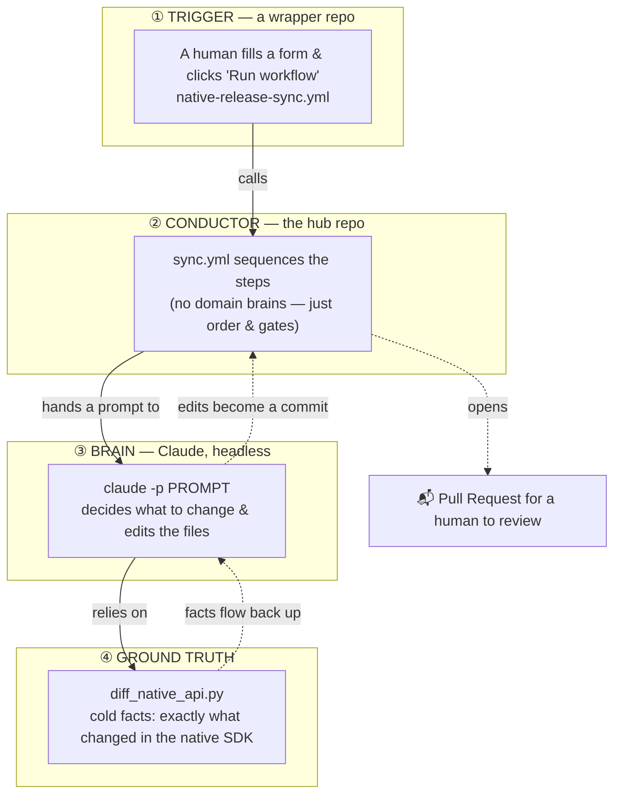

# The 4-Layer Onion — the one model that explains everything

> **Read this twice.** Every other page in this kit is a zoom-in on one of these four layers.
> If you understand the onion, you understand the system.

When CleverTap releases a new native SDK, the wrapper needs to catch up. This system does that
catch-up. It is built as **four layers**. A maintainer's click travels **down**; a finished
pull request travels back **up**.

---

## Layer ① — TRIGGER (a button in the wrapper repo)

**Where:** each wrapper repo has a tiny file, `.github/workflows/native-release-sync.yml`.

**What it is:** a *form*. A maintainer opens the wrapper repo's "Actions" tab, picks the native
versions to sync to (e.g. Android `core` → `8.2.0`), and clicks **Run workflow**.

**What it does:** almost nothing itself — it just **calls** the shared workflow in the hub repo
and passes along the versions and four secrets. Think of it as a doorbell.

> 🧠 **Analogy:** the trigger is a **vending machine button**. Pressing it doesn't make the snack —
> it tells the machine behind the glass to do that.

---

## Layer ② — CONDUCTOR (`sync.yml` in the hub repo)

**Where:** `clevertap-wrapper-tooling/.github/workflows/sync.yml` (the file you're learning about).

**What it is:** the **conductor of an orchestra**. It knows the *order* things happen in, but it
doesn't play any instrument itself.

**What it does, in order:**
1. **Setup** — mint a bot token, check out the wrapper repo, make a fresh branch.
2. **Pre-sync build gate** — build the example app *before* any changes. If it's already broken,
   stop now (so we don't spend money on the AI for a doomed run).
3. **Sync Android, then Sync iOS** — hand the work to Layer ③ (Claude).
4. **Post-sync build** — rebuild with the AI's changes to see if they compile.
5. **Commit, push, open the PR** — package the result for a human.
6. **Report cost / notify on failure.**

The conductor's cleverness is **not** domain knowledge — it's *gating*: deciding which steps run
based on what succeeded or failed. Those `if:` conditions are the hardest part of the file, and
they get their own [line-by-line walkthrough](../20-walkthroughs/sync-yml.md).

> 🧠 **Analogy:** the conductor is a **recipe checklist**: "preheat oven; if the batter rose, frost
> it; if it burned, throw it out." The checklist doesn't know how to bake — it just enforces order.

---

## Layer ③ — BRAIN (Claude, running headless)

**Where:** the `claude-sync` composite action runs `claude -p "<prompt>"`. The prompt lives in
`prompts/sync-orchestrator-cordova.md`; the deep know-how lives in the wrapper repo's
`.claude/skills/`.

**This is the layer beginners get wrong, so slow down:**

> ### ⚠️ The single most important idea in this whole system
> **The YAML files do not wrap any APIs.** `sync.yml` cannot read a diff, decide what's worth
> exposing, or write Kotlin. All of that judgment and code-writing is done by an **AI** that the
> conductor *hands a written prompt to*. Layer ② is plumbing; Layer ③ is intelligence.

What Claude actually does: read the facts from Layer ④, decide for each change whether to
**surface / skip / defer / flag**, write the bridge code on all sides (JavaScript, Android, iOS),
bump the versions, update the changelog and example apps — then emit a structured summary.

> 🧠 **Analogy:** Claude is the **chef**. The conductor (②) handed it the order ticket (the prompt);
> the chef decides how to cook and actually cooks. But a chef only cooks with real ingredients —
> which is why it leans on Layer ④.

---

## Layer ④ — GROUND TRUTH (`diff_native_api.py`)

**Where:** `clevertap-wrapper-tooling/tools/diff_native_api.py` — a ~1300-line Python program.

**What it is:** the one **deterministic, non-AI** component. Given two native versions, it reports
*exactly* what changed: which methods were added/removed/changed, which build settings moved,
and the relevant changelog text. No opinions, no judgment.

**Why it matters:** an AI can hallucinate. This tool cannot — it only reports what is literally in
the source code. So Claude (③) is told to **trust this tool as fact** and to **verify any method in
the real source before using it**. The diff tool is the leash that keeps the AI honest.

Its one honest limitation: it finds methods with **regex** (pattern-matching), which catches ~80%
of changes. The other ~20% are caught by the **recall pass** — re-reading the native changelog.
This tradeoff is explained in [the diff-tool walkthroughs](../20-walkthroughs/diff-native-api/).

> 🧠 **Analogy:** the diff tool is the **librarian who only tells you what's actually on the shelf**.
> Claude is the **editor who decides what to publish**. You want the editor creative — but anchored
> to a librarian who never makes things up.

---

## Putting it together: one sentence per layer

1. **Trigger:** a human presses a button to ask for a sync.
2. **Conductor:** a YAML workflow runs the steps in order and decides what runs based on what passed.
3. **Brain:** an AI reads the changes and rewrites the wrapper to match.
4. **Ground truth:** a plain Python tool reports the cold facts the AI must obey.

The output is always the same shape: **a pull request a human reviews and merges.** The human is
never removed — the automation does the tedious 90%, the human approves.

---

## ✅ Check yourself

Answer out loud or on paper *before* expanding. Retrieval is the point.

1. Which layer actually writes the Kotlin/JavaScript/Objective-C bridge code?

**Layer ③ (the Brain — Claude).** The conductor (`sync.yml`) only sequences steps; it has no
ability to write wrapper code. This is the idea beginners most often get backwards.

2. Why does a non-AI Python tool (Layer ④) exist if Claude is so capable?

Because an AI can hallucinate a method that doesn't exist. The diff tool reports only what is
literally in the source, giving Claude a factual anchor. Claude is told to trust it and to
source-verify before using any symbol.

3. The pre-sync build runs *before* Claude does anything. Why?

To fail fast and cheap. If the example app is already broken, the run stops before spending money
on the AI — no point syncing into a pipeline that can't build.

4. What is the system's output, every single time?

A **pull request** for a human to review and merge. The human approval step is never automated away.

**Next:** [03 — a day in the life of one real sync →](./03-a-day-in-the-life.md)
