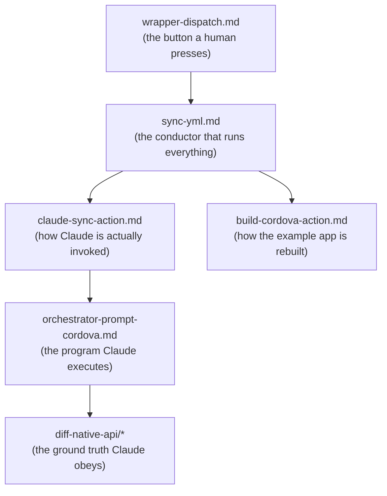

# Walkthroughs — read the system one file at a time

This folder is the **line-by-line tour** of the CleverTap native-release-sync automation.
Each page takes one real source file (or one section of it) and explains **what every line
does**, visually, for someone who has never written Python, YAML, shell, or a GitHub Action.

> 🧠 **How to use this folder:** start at the top of the ranking table and work down. The
> [4-layer onion primer](../00-primer/02-the-4-layer-onion.md) is the map; these pages are the
> street-level walk. Every new word is defined inline in a 🟦 sidebar and again in the
> [GLOSSARY](../GLOSSARY.md).

## What gets line-by-line vs annotated-highlights, and why

Not every file deserves the same microscope. Tricky logic (regex, gating `if:` expressions,
shell exit handling) gets **every line**. Configuration that is mostly "fill in the blank" gets
**annotated highlights** — we point at the lines that matter and skip the boilerplate.

| Rank | File | Treatment | Walkthrough |
|------|------|-----------|-------------|
| **1** | `tools/diff_native_api.py` | **full line-by-line** (11 pages) — the only non-AI part; it is the ground truth | [diff-native-api/00-overview.md →](./diff-native-api/00-overview.md) |
| **2** | `.github/workflows/sync.yml` | **line-by-line for the `if:` gating expressions**, annotated for the rest | [sync-yml.md](./sync-yml.md) |
| **3** | `.github/actions/claude-sync/action.yml` | **line-by-line for the `run:` block** (envsubst → `claude -p` → jq) | [claude-sync-action.md](./claude-sync-action.md) |
| **4** | `prompts/sync-orchestrator-cordova.md` | **annotated highlights** — how to read a prompt as a program | [orchestrator-prompt-cordova.md](./orchestrator-prompt-cordova.md) |
| **5** | `.github/actions/build/cordova/action.yml` | **annotated highlights** — CI build quirks | [build-cordova-action.md](./build-cordova-action.md) |
| **6** | wrapper repo `native-release-sync.yml` | **annotated highlights** — the 73-line trigger form | [wrapper-dispatch.md](./wrapper-dispatch.md) |

## A suggested reading order

If you want the story rather than the ranking:

1. **[wrapper-dispatch.md](./wrapper-dispatch.md)** — the form a maintainer fills in. Where it all starts.
2. **[sync-yml.md](./sync-yml.md)** — the *conductor* (Layer ② in the onion). Wires every step together.
3. **[claude-sync-action.md](./claude-sync-action.md)** — the *brain* (Layer ③). How `claude -p` is run headless.
4. **[orchestrator-prompt-cordova.md](./orchestrator-prompt-cordova.md)** — the prompt Claude follows, read as a program.
5. **[diff-native-api/00-overview.md](./diff-native-api/00-overview.md)** — the *ground truth* (Layer ④). 11 pages.
6. **[build-cordova-action.md](./build-cordova-action.md)** — how the example app is rebuilt to catch breakage.

**Next:** [sync-yml.md — the conductor →](./sync-yml.md)
