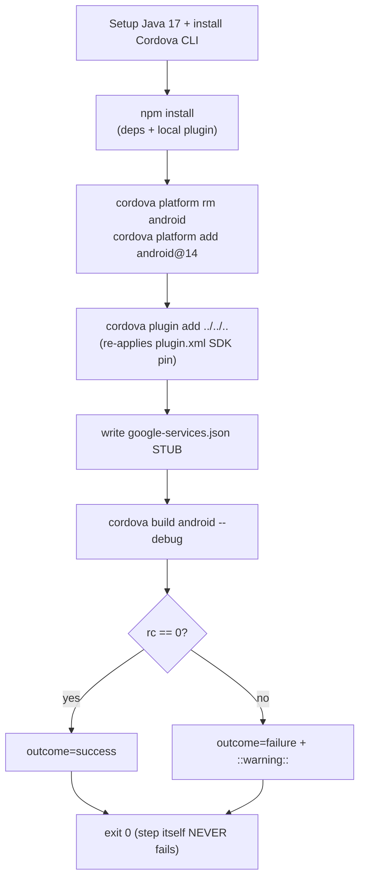

# `build/cordova` action — rebuilding the example app

> **In one sentence:** this composite action regenerates the Cordova example app's platforms against
> the (possibly Claude-bumped) `plugin.xml` and tries to build Android and/or iOS — capturing
> per-platform *outcomes* without itself failing.
> **File:** `.github/actions/build/cordova/action.yml`.

This is the **build verifier**. The conductor calls it twice: **pre-sync** (does it build *before*
Claude touches anything? — abort early if not, to save Claude cost) and **post-sync** (does it
*still* build after Claude's edits? — open the PR with a `build-failed` label if not). This page is
annotated highlights — the CI-specific quirks are what matter.

## The shape (read this first)



> 🧠 **Analogy:** before and after a mechanic works on your car, you start the engine to check it
> still runs. Pre-sync = "did it run before I touched it?" Post-sync = "does it still run now?" The
> mechanic doesn't refuse to give the car back if it won't start — they hand it over with a note
> ("won't start"). That note is the `outcome` output.

---

## Quirk 1 — platforms are *regenerated*, pinned to a major

```bash
        cordova platform rm android || true          # ① throw away the committed platform
        cordova platform add android@14              # ② re-add it, pinned to cordova-android 14.x
        ...
        cordova platform rm ios || true
        cordova platform add ios@7                    # iOS pinned to cordova-ios 7.x
```

| # | What this does | In plain English |
|---|----------------|------------------|
| ① | `platform rm android \|\| true` | "Delete the checked-in `platforms/android` folder. `\|\| true` = 'if it's already gone, don't treat that as an error.'" |
| ② | `platform add android@14` | "Re-generate the platform from scratch, **pinned to major 14**. This rebuilds it against the *current* `plugin.xml` SDK pin." |

**Why regenerate?** The committed platforms carry **stale** SDK pins (the action header notes Android
7.1.2 / iOS 5.1.2). After a sync, `plugin.xml` points at a new SDK version — but the old `platforms/`
folder still references the old one. Deleting and re-adding forces Cordova to read the fresh
`plugin.xml`. **Why pin `@14` / `@7`?** A bare `cordova platform add android` grabs the *latest*
(15.x), whose `CoreAndroid.java` references `VERSION_CODES.BAKLAVA` (API 36) and won't compile against
the installed SDK. Pinning to the major the example declares keeps the build reproducible.

> ### 🟦 Beginner sidebar: what does `|| true` mean?
> In bash, `A || B` runs `B` only if `A` *fails* (returns non-zero). `cordova platform rm android ||
> true` therefore means "try to remove the platform; if removal fails (e.g. it wasn't there),
> swallow the error and carry on." It's how you make a cleanup step non-fatal.

> ### 🟦 Beginner sidebar: what is `cordova plugin add ../../..`?
> `../../..` is a **relative path** — three folders up from the example project — which is the root of
> the wrapper repo (the plugin itself). Adding the local plugin re-applies its `plugin.xml`
> `<framework>` / `<pod>` entries (the current SDK pin) and passes the test credentials as
> `--variable`s. The comment notes Cordova's auto-restore mis-resolves this relative path, so it's
> added explicitly.

---

## Quirk 2 — the google-services.json stub (a heredoc)

The Google Services Gradle plugin refuses to build without a valid `google-services.json`, and the
one shipped in the plugin is a 0-byte stub. CI writes a syntactically valid one on the fly:

```bash
        mkdir -p platforms/android/app
        cat > platforms/android/app/google-services.json <<'EOF'   # ① write a file from a heredoc
        {
          "project_info": { "project_number": "000000000000", ... },
          "client": [
            {
              "client_info": {
                "mobilesdk_app_id": "1:000000000000:android:00000...",
                "android_client_info": { "package_name": "com.clevertap.example" }   # ② MUST match the app id
              },
              "api_key": [ { "current_key": "STUB_CI_KEY_NOT_FOR_USE" } ],           # ③ obviously fake
              ...
            }
          ],
          "configuration_version": "1"
        }
        EOF
```

| # | What this does | In plain English |
|---|----------------|------------------|
| ① | `cat > file <<'EOF' … EOF` | "A **heredoc**: everything between `<<'EOF'` and `EOF` is written verbatim into the file. The quotes around `'EOF'` mean 'don't expand `$variables` — write it literally.'" |
| ② | `package_name: com.clevertap.example` | "The Google Services plugin cross-checks this against the app's widget id. It must match the example's id or the build fails." |
| ③ | `STUB_CI_KEY_NOT_FOR_USE` | "A deliberately fake key. We only need the file to be *valid JSON of the right shape* — it's never used to call Google." |

> ### 🟦 Beginner sidebar: what is a *heredoc*?
> A heredoc lets you write a multi-line block straight into a command. `cat > file <<'EOF'` says
> "everything up to the next line that is just `EOF` is the input." With `cat >`, that input becomes
> the file's contents. The single-quoted `'EOF'` disables variable expansion — handy here because the
> JSON is meant to be literal. See [GLOSSARY](../GLOSSARY.md).

---

## Quirk 3 — the outcome-capture pattern (`set +e` → `rc=$?` → `exit 0`)

This is the most important pattern in the file, and it appears at the end of *both* the Android and
iOS build steps:

```bash
        set +e                                       # ① don't abort on a build failure
        ...
        cordova build android --debug                # ② the build that might fail
        rc=$?                                         # ③ capture its exit code
        if [ $rc -eq 0 ]; then
          echo "outcome=success" >> "$GITHUB_OUTPUT"   # ④ tell the conductor: success
        else
          echo "outcome=failure" >> "$GITHUB_OUTPUT"   # ④ tell the conductor: failure
          echo "::warning::Cordova Android build (${{ inputs.phase }}) failed with $rc"
        fi
        exit 0                                        # ⑤ the STEP itself always succeeds
```

| # | What this does | In plain English |
|---|----------------|------------------|
| ① | `set +e` | "Turn off bash auto-abort so a failed build doesn't kill the step before we record the result." |
| ② | `cordova build android --debug` | "The actual build. May pass or fail." (iOS uses `cordova build ios --emulator --debug` — unsigned, for the simulator, no provisioning in CI.) |
| ③ | `rc=$?` | "Save the build's exit code." |
| ④ | `echo "outcome=..." >> "$GITHUB_OUTPUT"` | "Write `outcome=success` or `outcome=failure` to the step's outputs file. This becomes the action's `android_outcome` / `ios_outcome` output." |
| ⑤ | `exit 0` | "**The step exits 0 (success) regardless of the build result.** The build's pass/fail is reported as *data* (the outcome output), not as the step's own success." |

**Why decouple the step's success from the build's success?** Because the *conductor* decides what to
do with a failed build, and that decision differs by phase. Look at the action's `outputs:` block:

```yaml
outputs:
  android_outcome:
    description: 'success / failure / empty(skipped) for the Android build.'
    value: ${{ steps.android.outputs.outcome }}     # surfaces the inner `outcome=` to the caller
  ios_outcome:
    description: 'success / failure / empty(skipped) for the iOS build.'
    value: ${{ steps.ios.outputs.outcome }}
```

- **Pre-sync:** the conductor's `Pre-sync build gate` reads these and `exit 1`s if either is
  `failure` — aborting *before* spending Claude tokens.
- **Post-sync:** the conductor still opens the PR (with a `build-failed` label) and only afterwards
  re-asserts failure to turn the run red. See the [sync.yml gating page](./sync-yml.md).

If the build step *itself* failed (non-zero exit), Actions' default skip-on-failure would derail this
two-phase logic. `exit 0` keeps the build result purely as a value the conductor inspects.

> ### 🟦 Beginner sidebar: step outputs vs step outcome
> Two different things. The **outcome** is success/failure/skipped that Actions assigns to a step
> automatically. An **output** is a named value the step *chooses* to publish via `>> "$GITHUB_OUTPUT"`.
> This action deliberately makes its *outcome* always success and reports the build result as an
> *output* (`outcome=success|failure`) instead — so the caller, not Actions, decides the consequence.

---

## ✅ Check yourself

<details>
<summary>1. Why does the build step end with <code>exit 0</code> even when the build failed?</summary>

So the *step's* outcome stays `success` and Actions doesn't auto-skip everything after it. The build's
real result is published as an **output** (`outcome=failure`) that the conductor reads. That lets
pre-sync abort-on-failure and post-sync open-the-PR-with-a-label behave differently from the same
action.
</details>

<details>
<summary>2. Why are the platforms removed and re-added instead of using the committed ones?</summary>

The committed `platforms/` carry stale SDK pins (Android 7.1.2 / iOS 5.1.2). After a sync,
`plugin.xml` points at a new version. `platform rm` + `platform add` regenerates them against the
*current* `plugin.xml`, so the build actually exercises the bumped SDK.
</details>

<details>
<summary>3. Why pin <code>cordova platform add android@14</code> instead of a bare <code>add</code>?</summary>

A bare add fetches the latest cordova-android (15.x), whose `CoreAndroid.java` uses
`VERSION_CODES.BAKLAVA` (API 36) and won't compile against the installed SDK. Pinning to major 14 —
the version the example declares — keeps the build reproducible.
</details>

<details>
<summary>4. Why write a stub <code>google-services.json</code> with a fake key?</summary>

The Google Services Gradle plugin won't build without a valid-looking file, and the shipped one is a
0-byte stub. CI only needs valid JSON of the right shape with a matching `package_name`
(`com.clevertap.example`) — the key is never used to contact Google, hence `STUB_CI_KEY_NOT_FOR_USE`.
</details>

**Next:** [wrapper-dispatch.md — the trigger form a human fills in →](./wrapper-dispatch.md)
