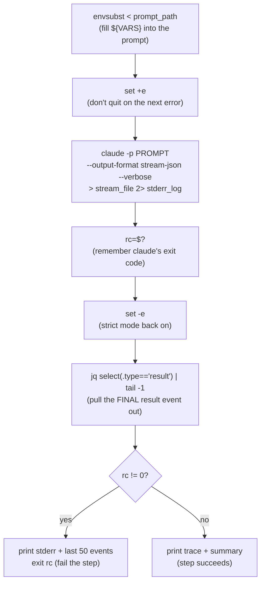

# `claude-sync` action — the Brain, invoked headless

> **In one sentence:** this composite action renders the orchestrator prompt, runs `claude -p` for
> ONE platform with a strict tool allowlist, captures the full event stream, and extracts the final
> result envelope — failing the step if Claude errored.
> **File:** `.github/actions/claude-sync/action.yml`, the `run:` block (lines ~67–104). This is
> **Layer ③ (the Brain)** of the [4-layer onion](../00-primer/02-the-4-layer-onion.md).

The conductor ([sync.yml](./sync-yml.md)) calls this action twice — once for Android, once for iOS.
Everything interesting is in one shell `run:` block, so this whole page is line-by-line.

## The shape (read this first)



> 🧠 **Analogy:** the prompt file is a fill-in-the-blank form letter. `envsubst` fills the blanks
> (`${PLATFORM}`, `${NEW_VERSION}`, …) with this run's real values. Then we hand the finished letter
> to Claude, tape-record everything it says (`stream_file`), and at the end keep just the final
> summary line.

---

## The `env:` block — what feeds the blanks

Before the script runs, the action sets environment variables. These are exactly the `${...}` blanks
the prompt expects:

```yaml
    - name: Sync ${{ inputs.platform }}
      working-directory: ${{ inputs.wrapper_path }}     # run inside the cloned wrapper repo
      shell: bash
      env:
        ANTHROPIC_API_KEY: ${{ inputs.anthropic_api_key }}   # the key claude needs to authenticate
        PLATFORM: ${{ inputs.platform }}                     # android | ios
        MODULE: ${{ inputs.module }}                         # core | pushtemplates | hms
        NEW_VERSION: ${{ inputs.new_version }}
        DIFF_TOOL_PATH: ${{ inputs.diff_tool_path }}
        RELEASE_DATE: ${{ inputs.release_date }}
        OTHER_PLATFORM_SYNCING: ${{ inputs.other_platform_syncing }}
      run: |
        ...
```

These names match the placeholders inside [`sync-orchestrator-cordova.md`](./orchestrator-prompt-cordova.md)
(`**Platform:** ${PLATFORM}`, `**New version:** ${NEW_VERSION}`, etc.). That correspondence is the
whole point of the next line.

---

## The code, annotated (the `run:` block)

```bash
        prompt="$(envsubst < "${{ inputs.prompt_path }}")"        # ①
        echo "Prompt length: ${#prompt} chars"                    # ②
        out_dir="$(dirname "${{ inputs.output_file }}")"          # ③
        stderr_log="${out_dir}/claude-stderr-${{ inputs.platform }}.log"
        stream_file="${out_dir}/claude-stream-${{ inputs.platform }}.jsonl"
        set +e                                                    # ④
        claude -p "$prompt" \                                     # ⑤
               --model "${{ inputs.model }}" \                    # ⑥
               --allowed-tools "${{ inputs.allowed_tools }}" \    # ⑦
               --output-format stream-json --verbose \            # ⑧
               > "$stream_file" \                                 # ⑨
               2> "$stderr_log"                                   # ⑨
        rc=$?                                                     # ⑩
        set -e                                                    # ⑪
        jq -c 'select(.type=="result")' "$stream_file" 2>/dev/null | tail -1 > "${{ inputs.output_file }}" || true   # ⑫
        if [ $rc -ne 0 ]; then                                    # ⑬
          echo "::error::claude exited with $rc"
          echo "::group::stderr"; cat "$stderr_log" || true; echo "::endgroup::"
          echo "::group::stream (last 50 events)"; tail -50 "$stream_file" || true; echo "::endgroup::"
          exit $rc                                                # ⑭
        fi
        echo "::group::${{ inputs.platform }} — Claude step trace (tools, files, denials)"
        python3 "${{ inputs.tooling_root }}/scripts/trace-claude-actions.py" "$stream_file" || true   # ⑮
        echo "::endgroup::"
        echo "${{ inputs.platform }} sync produced:"
        python3 "${{ inputs.tooling_root }}/scripts/summarize-claude-output.py" \
            "${{ inputs.output_file }}" || true                   # ⑯
```

| # | What this line does | In plain English |
|---|---------------------|------------------|
| ① | `envsubst < prompt_path` | "Read the prompt file and replace every `${PLATFORM}`, `${NEW_VERSION}`, … with the env values set above. Store the finished text in `$prompt`." |
| ② | `${#prompt}` | "`${#x}` is the *length* of `$x`. Just logging how many characters the rendered prompt came to — a sanity check." |
| ③ | `dirname` | "Take the folder part of the output path, so the stderr/stream logs land next to the result file." |
| ④ | `set +e` | "Turn OFF 'exit immediately on error.' We *expect* claude might exit non-zero and want to handle it ourselves, not crash." |
| ⑤ | `claude -p "$prompt"` | "Run Claude in **headless / print mode** (`-p`): feed it the prompt, let it work, no interactive chat." |
| ⑥ | `--model` | "Which model (sonnet/opus/haiku) — passed down from the dispatch form." |
| ⑦ | `--allowed-tools` | "The security fence: the exact comma-separated list of tools Claude may use. Anything else is denied." |
| ⑧ | `--output-format stream-json --verbose` | "Emit the full turn-by-turn event stream as JSON lines — every Read/Edit/Write/Bash call, every result, every permission denial." |
| ⑨ | `> "$stream_file" 2> "$stderr_log"` | "Redirect: `>` sends normal output (the event stream) to one file; `2>` sends error output to another." |
| ⑩ | `rc=$?` | "`$?` is the exit code of the command that just ran. Save claude's exit code in `rc` so we can check it after." |
| ⑪ | `set -e` | "Turn strict mode back ON — from here, any unexpected error stops the script again." |
| ⑫ | `jq ... select(.type=="result") | tail -1` | "From the stream of JSON events, keep only the one `{\"type\":\"result\"}` envelope (the final summary), take the last one, and write it as the result file. `|| true` so an empty stream doesn't fail the step." |
| ⑬ | `if [ $rc -ne 0 ]` | "If claude's exit code was NOT zero (it errored)…" |
| ⑭ | `exit $rc` | "…print the stderr and last 50 events for debugging, then fail this step with claude's code — the conductor's `if:` gates then skip the PR." |
| ⑮ | `trace-claude-actions.py` | "On success: print a human-readable trace of which tools/files Claude touched (and what was denied)." |
| ⑯ | `summarize-claude-output.py` | "Print a short summary of the result envelope (what was surfaced/skipped, cost)." `|| true` = best-effort, never fail the step on a printing hiccup. |

---

## Beginner sidebars

> ### 🟦 Beginner sidebar: what is `envsubst`?
> `envsubst` is a tiny Unix tool that reads text and substitutes environment variables. If the file
> contains `New version: ${NEW_VERSION}` and the env has `NEW_VERSION=8.3.0`, the output is
> `New version: 8.3.0`. `< file` feeds the file in as input. It's how a *static* prompt template
> becomes a *run-specific* prompt without any templating engine. See [GLOSSARY](../GLOSSARY.md).

> ### 🟦 Beginner sidebar: `set +e` / `set -e` and exit codes
> Every command returns an **exit code**: `0` = success, anything else = some kind of failure. Bash's
> `set -e` means "stop the whole script the instant any command returns non-zero." That's safe by
> default — but here we *want* to let `claude` fail and then inspect *why*. So we `set +e` (turn the
> auto-stop OFF) around the `claude` call, capture its code with `rc=$?`, then `set -e` to restore
> strict mode. Classic "I'll handle this error myself" pattern.

> ### 🟦 Beginner sidebar: what is `claude -p` (headless / print mode)?
> `claude -p "<prompt>"` runs Claude Code **non-interactively**: it takes one prompt, does the work
> (reading files, editing, running allowed commands), and exits. No chat window, no human. That's why
> the prompt has to be a complete *program* with its own completion gate — there's nobody to answer a
> follow-up question. See [orchestrator-prompt-cordova.md](./orchestrator-prompt-cordova.md).

> ### 🟦 Beginner sidebar: what is `--allowed-tools` (and why pin `python3`)?
> It's an explicit **allowlist** of the tools Claude may use this run. The conductor builds it (see
> [sync.yml](./sync-yml.md)) so that, for example, `python3` is allowed **only** to run the diff tool
> (`Bash(python3 <DIFF_TOOL>:*)`) — never `python3 -c "..."` arbitrary code. `WebFetch`/`WebSearch`
> are deliberately left off. Anything not on the list is **denied**, and the denial shows up in the
> stream (which is why `--verbose` matters for debugging).

> ### 🟦 Beginner sidebar: stream-json, JSON Lines, and `jq`
> `--output-format stream-json` emits **JSON Lines** (`.jsonl`): one JSON object per line, one per
> event. `jq` is a command-line JSON processor. `jq -c 'select(.type=="result")'` reads every line
> and keeps only objects whose `type` field equals `"result"`; `-c` prints them compactly;
> `tail -1` keeps the last one. That final object is the same `.result` / `.total_cost_usd` /
> `.usage` envelope the older `--output-format json` produced — so the downstream cost/summary/PR
> scripts keep working unchanged.

> ### 🟦 Beginner sidebar: why NOT `--bare`?
> The code comment is explicit: `--bare` would skip auto-discovery of the wrapper repo's
> `.claude/skills`. The orchestrator prompt **relies** on those skills (it invokes them step by step).
> Running non-bare loads them like an interactive session would. Dropping `--bare` here is a
> deliberate correctness choice, not an oversight.

---

## ✅ Check yourself

<details>
<summary>1. Why <code>set +e</code> around the <code>claude</code> call?</summary>

So a non-zero exit from `claude` doesn't instantly abort the script. We want to capture the code
(`rc=$?`), still write the result file, print stderr + the last 50 events, and *then* fail
deliberately with `exit $rc`. `set +e` turns off bash's auto-abort just for that span.
</details>

<details>
<summary>2. What does <code>jq -c 'select(.type=="result")' ... | tail -1</code> extract, and why?</summary>

From the full JSON-Lines event stream it keeps only the final `{"type":"result"}` envelope — the
same summary object the old `--output-format json` produced (`.result`, `.total_cost_usd`,
`.usage`). Downstream cost/summary/PR scripts read *that* file, so the extraction keeps them working
even though we now emit a verbose stream.
</details>

<details>
<summary>3. The step ends with <code>exit $rc</code> on failure. What does that trigger upstream?</summary>

A non-zero exit makes this step's **outcome** `failure`. The conductor's commit/push/open-PR `if:`
gates check `steps.sync_*.outcome != 'failure'`, so they skip — no PR is opened from a broken sync.
See [sync-yml.md](./sync-yml.md).
</details>

<details>
<summary>4. Why is the prompt rendered with <code>envsubst</code> instead of being hard-coded?</summary>

One prompt template serves every run. `envsubst` injects this run's `${PLATFORM}`, `${MODULE}`,
`${NEW_VERSION}`, `${RELEASE_DATE}`, `${OTHER_PLATFORM_SYNCING}`, etc. from the `env:` block, so the
same file works for Android and iOS, any version, any date — no code change needed.
</details>

**Next:** [orchestrator-prompt-cordova.md — read the prompt as a program →](./orchestrator-prompt-cordova.md)
