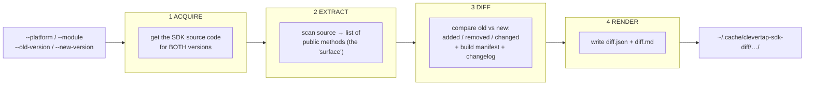

# `diff_native_api.py` — Overview (the whole tool in one page)

> **Where this sits:** Layer ④ (Ground Truth) of the [4-layer onion](../../00-primer/02-the-4-layer-onion.md).
> This is the only part of the system that is *not* an AI. It reports cold facts; Claude obeys them.

This file is ~1300 lines and looks scary. It isn't — it's **four small stages in a row**, each one
turning its input into the next stage's input. Learn the four stages here, then the next ten pages
zoom into each one. You'll never have to hold all 1300 lines in your head at once.

## What it's for, in one sentence

> Given **two versions** of a CleverTap native SDK, print out **exactly what changed** — which
> public methods were added/removed/changed, which build settings moved, and the relevant
> changelog text — as two files: `diff.json` (for the machine) and `diff.md` (for humans).

You run it like this (from the [README](../../../README.md)):

```bash
python3 tools/diff_native_api.py \
    --platform android --module core \
    --old-version 8.1.0 --new-version 8.2.0 \
    --local-path /path/to/local/clevertap-android-sdk
```

## The shape — four stages



| Stage | What it does | Walkthrough page |
|-------|--------------|------------------|
| **1. Acquire** | Find the SDK source for each version — local clone, cache, or download from GitHub. | [02 — source acquisition](./02-source-acquisition.md) |
| **2. Extract** | Read the source files and pull out every public method (the "API surface"). | [03 Java/Kotlin](./03-surface-extraction-java-kotlin.md), [04 Obj-C](./04-surface-extraction-objc.md) |
| **3. Diff** | Compare the two surfaces (added/removed/changed) + compare build settings + grab changelog. | [05 diffing](./05-diffing.md), [06 Android build](./06-build-manifest-android.md), [07 iOS build](./07-build-manifest-ios.md), [08 changelog](./08-changelog-crossvalidation.md) |
| **4. Render** | Turn the result into `diff.json` and `diff.md`. | [09 output](./09-output-rendering.md) |
| (wiring) | `main()` reads the arguments and calls stages 1→4 in order. | [10 main](./10-main-orchestration.md) |

## The top of the file: the docstring tells you everything

The first 42 lines are a `"""triple-quoted string"""` — a **docstring**: a comment that documents
the whole file. It already states the four stages, the source-acquisition order, and the two
deliberate design choices you must remember:

```python
Design notes:
    - Regex-based parsing (not AST). Catches ~80% of public-surface changes
      cleanly; the remaining noise is for the engineer to triage.
    - @RestrictTo / @Hide annotated methods on Android are filtered out.
    - All extracted symbols are sorted by name for stable diffs.
```

> ### 🟦 Beginner sidebar: "regex-based, not AST" — why it matters
> The tool finds methods using **[regex](../../GLOSSARY.md)** (text pattern-matching) instead of a
> full code parser (**AST**). Regex is simpler but imperfect — it catches about **80%** of changes.
> This is not a bug; it's a deliberate trade-off. The missing ~20% is caught later by the
> **recall pass** (re-reading the changelog — see [page 08](./08-changelog-crossvalidation.md)).
> Whenever someone says "the diff tool might miss a method," *this* is why.

> ### 🟦 Beginner sidebar: what are these `import` lines (44–59)?
> ```python
> import argparse, json, os, re, shutil, subprocess, sys, tarfile, tempfile, tomllib, urllib...
> ```
> Each `import` pulls in a tool from Python's **standard library** (built in — nothing to install).
> The ones worth knowing: `re` = regex; `subprocess` = run `git`; `urllib` = download files;
> `tarfile` = unzip; `tomllib` = read Android's `.toml` config; `argparse` = read command-line
> options. The fact that *every* import is stdlib is why the tool needs **no `pip install`**.

## The mental model to keep

> 🧠 **The tool is an assembly line.** Raw material (two version numbers) enters; it passes through
> four stations (acquire → extract → diff → render); a finished report comes out. Each of the next
> pages is you standing at one station watching what it does.

---

## ✅ Check yourself

<details>
<summary>1. Name the four stages in order.</summary>

**Acquire → Extract → Diff → Render.** Get the source, pull out the public methods, compare old
vs new, write the report.
</details>

<details>
<summary>2. The tool finds methods with regex, catching ~80%. What catches the other 20%?</summary>

The **recall pass** — re-reading the native SDK's changelog and cross-checking it against the diff
(page 08). Method names the changelog mentions but the regex missed get flagged.
</details>

<details>
<summary>3. Why does the tool need no <code>pip install</code>?</summary>

Because it uses **only Python's standard library** — every `import` is built into Python itself.
</details>

**Next:** [02 — source acquisition (getting the SDK code) →](./02-source-acquisition.md)
