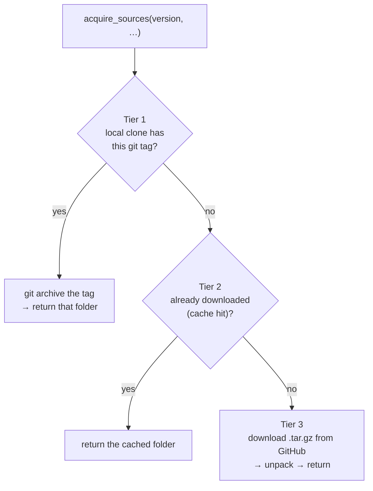

# Stage 1 — Source acquisition (`acquire_sources`)

> **In one sentence:** before we can compare two SDK versions, we need the actual source code for
> each — this stage finds it the cheapest way available.
> **File:** `tools/diff_native_api.py`, section *"Source acquisition"* (approx. lines 154–242).

## The shape (read this first)

There are **three places** the code might live, tried fastest-first. The first one that works wins.



> 🧠 **Analogy:** looking for a book — first check the shelf in your room (local), then the bag you
> packed yesterday (cache), then go buy it (download). You stop at the first place you find it.

## The code, annotated

```python
def acquire_sources(platform, module, version, local_path, cache_dir, no_cache) -> Path:
    """Return a directory holding the SDK source tree at the requested tag."""
    repo, tag_fmt = REPOS[(platform, module)]      # ① look up WHICH repo + HOW its tags are named
    tag = tag_fmt.format(ver=version)              # ② "corev{ver}" + 8.2.0  →  "corev8.2.0"
    repo_slug = repo.split("/")[-1]                # ③ "CleverTap/clevertap-android-sdk" → "clevertap-android-sdk"

    # 1. Local clone with the tag available
    if local_path and local_path.exists():         # ④ TIER 1 — is a clone already on this machine?
        if _git_has_tag(local_path, tag):
            extract_dir = cache_dir / f"{repo_slug}-{tag}-fromlocal"
            extract_dir.mkdir(parents=True, exist_ok=True)
            _git_archive_to_dir(local_path, tag, extract_dir)   # ⑤ copy the tagged snapshot out
            return extract_dir
        else:
            print(f"[diff] local clone … does not have tag {tag}; falling through …", file=sys.stderr)

    # 2. Cache hit
    cache_target = cache_dir / f"{repo_slug}-{tag}"
    if cache_target.exists() and not no_cache:      # ⑥ TIER 2 — did we download it on a past run?
        return cache_target

    # 3. Tarball download
    cache_dir.mkdir(parents=True, exist_ok=True)
    return _download_and_extract(repo, tag, cache_dir, cache_target)   # ⑦ TIER 3 — fetch from GitHub
```

| # | What this line does | In plain English |
|---|---------------------|------------------|
| ① | Tuple-key dict lookup in `REPOS` | "The phone book for SDK repos. Ask it for `(android, core)`, get back the GitHub repo *and* its tag pattern." |
| ② | `str.format` fills a blank | "The tag pattern for Android core is `corev{ver}`. Plug in `8.2.0` → the real tag `corev8.2.0`." |
| ③ | `split("/")[-1]` | "Take the last bit after the slash — the short repo name, used for naming cache folders." |
| ④ | `if` guard + early return | "Tier 1: if you handed me a local clone that has this tag, use it — fastest, no download." |
| ⑤ | `_git_archive_to_dir` | "Pull just the tagged snapshot out of the clone into a clean folder." |
| ⑥ | cache check | "Tier 2: if a past run already downloaded this tag, reuse it (unless `--no-cache`)." |
| ⑦ | `_download_and_extract` | "Tier 3: nothing local — download the `.tar.gz` from GitHub and unpack it." |

> ### 🟦 Beginner sidebar: what is a *tuple key* (`REPOS[(platform, module)]`)?
> A Python **dict** is a lookup table. Usually the key is one word. Here the key is a **pair**:
> `("android", "core")`. Pairs (tuples) can be keys because they never change. It's how the tool
> says "for THIS platform AND THIS module together, here's the repo and tag format." The table:
> ```python
> REPOS = {
>     ("android", "core"): ("CleverTap/clevertap-android-sdk", "corev{ver}"),
>     ("ios",     "core"): ("CleverTap/clevertap-ios-sdk",     "{ver}"),
>     # …
> }
> ```
> Notice Android core tags look like `corev8.2.0` but iOS tags are just `8.2.0`. That difference is
> *data*, not code — which is why it lives in this table.

> ### 🟦 Beginner sidebar: `cache_dir / f"{repo_slug}-{tag}"` — paths built with `/`
> `cache_dir` is a `Path` object ([pathlib](../../GLOSSARY.md)). The `/` operator joins path pieces
> like Lego: `~/.cache/clevertap-sdk-versions` `/` `clevertap-android-sdk-corev8.2.0`. No string
> gluing, works on every OS. `f"{repo_slug}-{tag}"` is an **f-string** — a template where `{…}`
> gets replaced by the variable's value.

## The three helpers it calls

You don't need every line of these, just what they do:

- **`_git_has_tag(repo_path, tag)`** (≈193) — runs `git show-ref` to ask "does this clone contain
  that tag?" Returns `True`/`False`. Uses `subprocess` (see sidebar).
- **`_git_archive_to_dir(...)`** (≈204) — runs `git archive` to export the tagged snapshot as a tar
  stream, then unpacks it into the destination folder.
- **`_download_and_extract(...)`** (≈214) — the Tier-3 path: downloads
  `https://github.com/<repo>/archive/refs/tags/<tag>.tar.gz`, unpacks it, and **strips the single
  top-level folder** GitHub wraps everything in (so the destination *is* the source root). If the
  tag doesn't exist, it exits with a clear message pointing you to the repo's tags page.

> ### 🟦 Beginner sidebar: what is `subprocess`?
> Python can run other command-line programs. `subprocess.check_output(["git", "-C", path,
> "show-ref", …])` literally runs the `git` command and captures its output. That's how a Python
> file "uses git" without reimplementing git.

> ### 🟦 Beginner sidebar: why strip a top-level folder from the tarball?
> When GitHub gives you a repo as `.tar.gz`, everything is nested inside one folder with an
> unpredictable name (like `clevertap-android-sdk-corev8.2.0/`). The code unpacks into a temp
> "staging" area, checks there's exactly one folder inside, and renames *that* folder to the final
> destination — so later stages can assume the destination is the real source root.

## Why this stage exists

The diff is run **twice per sync** (once for the old version, once for the new). Acquisition is
the slow part (network), so the three-tier fallback makes repeat runs fast: a developer with a
local clone never hits the network; CI reuses its cache across runs.

---

## ✅ Check yourself

<details>
<summary>1. What are the three tiers, fastest-first?</summary>

**1) Local clone** (if it has the tag), **2) cache** (downloaded on a past run), **3) download**
the `.tar.gz` from GitHub. The first that works wins.
</details>

<details>
<summary>2. Why is the key to <code>REPOS</code> a pair like <code>("android","core")</code> instead of one word?</summary>

Because the repo and tag format depend on **both** the platform and the module together. A tuple
key lets one dict answer "for this platform-and-module, which repo and tag pattern?"
</details>

<details>
<summary>3. Android core tags look like <code>corev8.2.0</code> but iOS tags are <code>8.2.0</code>. Where is that difference handled?</summary>

In the `REPOS` data table (the tag-format string), **not** in the logic. `tag_fmt.format(ver=…)`
just fills the blank. Changing tag conventions = editing data, not code.
</details>

**Next:** [03 — pulling methods out of Java/Kotlin source →](./03-surface-extraction-java-kotlin.md)
