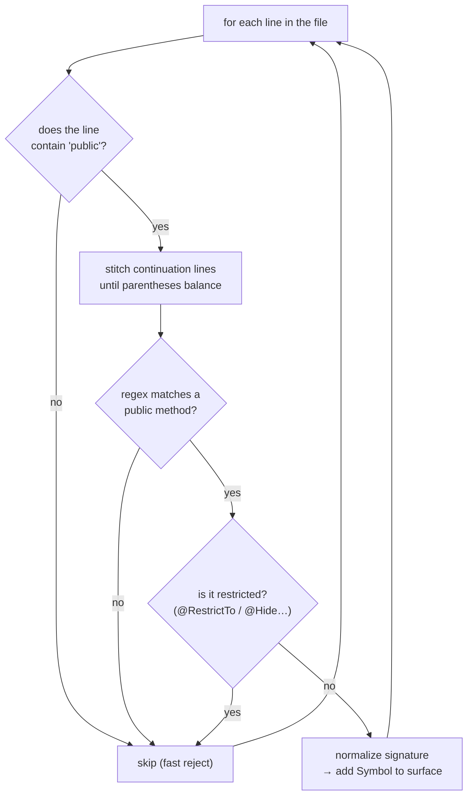

# Stage 2 — Pulling methods out of Java/Kotlin (`extract_surface`, `_extract_java`)

> **In one sentence:** read the Android source files line by line and collect every *public method*
> into a list (the "surface"), so the next stage can compare old vs new.
> **File:** `tools/diff_native_api.py`, section *"Public-surface extraction"* (approx. lines 245–410).

This is where the famous **regex** lives. Once you see how the line-scanner works, the "~80%
coverage" caveat will make complete sense.

## The shape (read this first)

For each source file, the code walks **line by line** and applies a small obstacle course to each
line. Only lines that survive every check become a recorded method.



## The dispatcher: `extract_surface`

```python
def extract_surface(source_root: Path, platform: str, module: str) -> Surface:
    surface = Surface()
    globs = SOURCE_GLOBS.get((platform, module), [])      # ① which files to scan for this platform+module
    for g in globs:
        for path in source_root.glob(g):                  # ② expand the wildcard pattern to real files
            ...
            if platform == "android":
                if path.suffix == ".java":
                    _extract_java(text, rel, surface)      # ③ Java files → Java extractor
                elif path.suffix == ".kt":
                    _extract_kotlin(text, rel, surface)    # ③ Kotlin files → Kotlin extractor
            elif platform == "ios":
                if path.suffix == ".h":
                    _extract_objc_header(text, rel, surface)  # (covered on page 04)
    return surface
```

| # | What it does | Plain English |
|---|--------------|---------------|
| ① | `SOURCE_GLOBS[(platform, module)]` | "Look up the list of file patterns to scan — e.g. `CleverTapAPI.java` and every `*Listener.java`." |
| ② | `source_root.glob(g)` | "Turn a wildcard like `**/*Listener.java` into the actual matching files on disk." |
| ③ | dispatch by file type | "Send `.java` to the Java reader, `.kt` to the Kotlin reader." |

> ### 🟦 Beginner sidebar: what is a *glob*?
> A glob is a filename wildcard. `*` = any name, `**` = any folders deep. So
> `clevertap-core/src/main/java/com/clevertap/android/sdk/**/*Listener.java` means "every file
> ending in `Listener.java`, in any sub-folder under the SDK package." The `SOURCE_GLOBS` table
> defines, per platform+module, exactly which files hold the public API.

## The Java line-scanner: `_extract_java`

```python
def _extract_java(text: str, rel: str, surface: Surface) -> None:
    lines = text.splitlines()
    i = 0
    while i < len(lines):
        line = lines[i]
        if "public" not in line:                       # ① FAST REJECT — no 'public', can't be a public method
            i += 1
            continue
        joined, j = _stitch_until_parens_balance(lines, i)   # ② glue wrapped lines into one
        m = _JAVA_PUBLIC_METHOD.match(joined)          # ③ try the regex
        if m:
            return_type, name, params = m.group(1), m.group(2), m.group(3)
            if return_type.strip() not in ("", name) and not _is_restricted(lines[max(0, i-5):i]):
                sig = _normalize_signature(params, return_type)   # ④ stable signature for CHANGED detection
                surface.add(Symbol(file=rel, kind="method", name=name, signature=sig))   # ⑤ record it
        i = j + 1
```

| # | What it does | Plain English |
|---|--------------|---------------|
| ① | `"public" not in line` | "Cheap check before the expensive regex — if the line doesn't even say `public`, move on." |
| ② | `_stitch_until_parens_balance` | "Java methods sometimes wrap across lines (long generic types). Glue them back into one line first." |
| ③ | `_JAVA_PUBLIC_METHOD.match` | "Run the pattern that recognizes `public ReturnType name(params)`." (anatomy below) |
| ④ | `_normalize_signature` | "Squash whitespace into a canonical form so we can later detect if a method *changed*." |
| ⑤ | `surface.add(Symbol(...))` | "Record the method: its file, name, and normalized signature." |

> ### 🟦 Beginner sidebar: why "stitch continuation lines"?
> A method like `public void onUserLogin(HashMap<String, Object> profile, String token)` might be
> written across two lines in the source. A line-by-line regex would miss it. `_stitch_until_
> parens_balance` keeps joining lines until every `(` has its matching `)`, so the regex sees the
> whole declaration. It only looks ahead a few lines (cheap and safe).

## Regex anatomy — decode `_JAVA_PUBLIC_METHOD` once and you've got it

Here is the real pattern, with each piece translated:

```python
_JAVA_PUBLIC_METHOD = re.compile(
    r"^\s*public\s+"                                   # A: start, optional spaces, the word 'public'
    r"(?!class\b|interface\b|enum\b|@interface\b|static\s+final\b)"  # B: NOT a class/interface/enum/constant
    r"(?:static\s+)?"                                  # C: maybe 'static'
    r"(?:final\s+)?"                                   # C: maybe 'final'
    r"(?:synchronized\s+)?"                            # C: maybe 'synchronized'
    r"(?:<[^>]+>\s+)?"                                 # C: maybe generic type params like <T>
    r"([\w\<\>\[\],\s\?\.]+?)\s+"                       # D: capture the RETURN TYPE  (group 1)
    r"(\w+)\s*"                                         # E: capture the METHOD NAME  (group 2)
    r"\(([^)]*)\)"                                      # F: capture the PARAMS in (…) (group 3)
)
```

| Piece | Regex bit | What it means |
|------|-----------|----------------|
| A | `^\s*public\s+` | Line starts (`^`), maybe spaces (`\s*`), then `public` and a space. |
| B | `(?!class\b|interface\b|…)` | A **negative lookahead**: "but NOT if the next word is `class`/`interface`/`enum`…" — so it ignores class declarations, only matches methods. |
| C | `(?:static\s+)?` etc. | **Optional** modifiers. `(?:…)` groups without capturing; the trailing `?` means "zero or one." |
| D | `([\w\<\>\[\],\s\?\.]+?)` | **Group 1 = the return type.** The character class allows letters, `<>` `[]` `,` `?` `.` (so `List<String>` works). `+?` = "as few characters as possible" (lazy). |
| E | `(\w+)` | **Group 2 = the method name** — a run of word characters. |
| F | `\(([^)]*)\)` | **Group 3 = the parameters** — everything between `(` and `)`. `[^)]*` = "any chars except `)`". |

So `m.group(1)`, `(2)`, `(3)` in the code are exactly **return type, name, params**.

> ### 🟦 Beginner sidebar: regex symbols cheat-sheet
> `^` start of line · `\s` whitespace · `\w` letter/digit/underscore · `*` zero-or-more ·
> `+` one-or-more · `?` optional (or "lazy" after `+`/`*`) · `(…)` a **capturing group** you can
> read back with `.group(n)` · `(?:…)` a group that *doesn't* capture · `(?!…)` "must NOT be
> followed by this" · `[^)]` "any character except `)`". That's 90% of what you need here.

> ### 🟦 Beginner sidebar: this is exactly why coverage is ~80%
> Look at piece **F**: `[^)]*` cannot handle a `)` *inside* the parameters (rare, but e.g. a method
> reference). And the whole thing is line-oriented. Kotlin default arguments, `@JvmOverloads`
> generating extra overloads, unusual wrapping — these slip past. The tool **knowingly** accepts
> this and leans on the [changelog recall pass](./08-changelog-crossvalidation.md) to catch the rest.
> When you hear "Claude missed an API," trace it here first.

## Filtering out internals: `_is_restricted`

Before recording a method, `_extract_java` checks the **previous few lines** for an annotation like
`@RestrictTo`, `@Hide`, `@Internal`, or `@VisibleForTesting` (the `_RESTRICTION_ANNOTATION` regex).
If found, the method is internal-only and is **skipped** — it should never be surfaced to wrapper
users. `_is_restricted` looks back up to 3 non-blank lines and stops early once it hits something
that clearly isn't an annotation/comment.

## Kotlin: same idea, different keyword

`_extract_kotlin` is the twin of `_extract_java`: it fast-rejects lines without `fun `, skips
`private`/`internal` functions, stitches wrapped lines, and matches `_KOTLIN_PUBLIC_FUN` (which
captures **name, params, optional return type** — Kotlin writes the return type *after* the params,
as `: ReturnType`). Same restriction check applies.

---

## ✅ Check yourself

<details>
<summary>1. In <code>_JAVA_PUBLIC_METHOD</code>, what do groups 1, 2, and 3 capture?</summary>

**1 = return type, 2 = method name, 3 = parameters.** That's why the code reads
`return_type, name, params = m.group(1), m.group(2), m.group(3)`.
</details>

<details>
<summary>2. What does the <code>(?!class\b|interface\b|…)</code> piece do, and why?</summary>

It's a **negative lookahead**: the line must NOT continue with `class`/`interface`/`enum`. Without
it, `public class CleverTapAPI {` would be mistaken for a method. It keeps the regex to *methods only*.
</details>

<details>
<summary>3. A public method exists in the new SDK but the diff didn't list it. Name two likely causes.</summary>

(a) Its declaration wrapped/formatted in a way the regex didn't catch (the ~80% limitation), or
(b) it carries a restriction annotation (`@RestrictTo`/`@Hide`) so it was deliberately filtered out.
The changelog recall pass is the safety net for case (a).
</details>

<details>
<summary>4. Why the cheap <code>"public" not in line</code> check before the regex?</summary>

Speed. Running a regex on every line of every file is wasteful; most lines obviously can't be a
public method, so a fast substring test rejects them before the expensive pattern runs.
</details>

**Next:** [04 — pulling selectors out of Objective-C headers →](./04-surface-extraction-objc.md)
