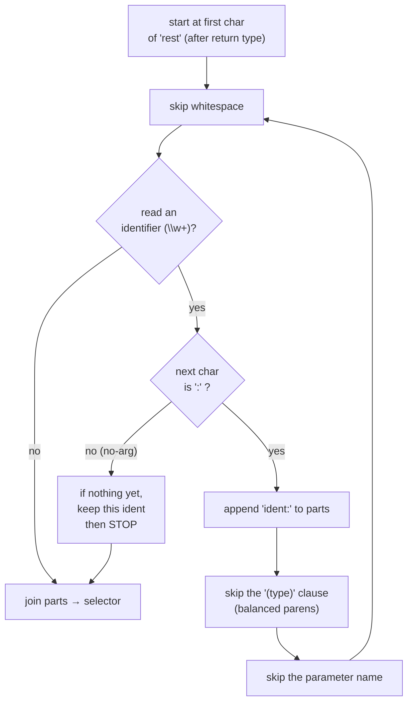

# Stage 2 (iOS) — Pulling selectors out of Objective-C headers (`_extract_objc_header`)

> **In one sentence:** read the iOS `.h` header files, find every Objective-C method declaration,
> and turn its quirky `name:(type)arg name2:(type)arg2` shape into one tidy *selector* string.
> **File:** `tools/diff_native_api.py`, section *"Public-surface extraction"* (approx. lines 412–513).

This is the iOS twin of [page 03](./03-surface-extraction-java-kotlin.md). Java/Kotlin methods look
like `name(params)`. Objective-C is different — its method names are **split up and interleaved with
the parameters**. The interesting part of this page is the little character-by-character walker that
stitches that split-up name back together.

## The shape (read this first)

`_objc_extract_selector` walks the declaration **one character at a time**, building the selector
piece by piece. It's a tiny **state machine**: read an identifier, look for a `:`, skip the
`(type)` and the parameter name, then loop back for the next piece.



> 🧠 **Analogy:** an Obj-C method name is a sentence with the words spread out:
> `recordEvent:(NSString *)event withProps:(NSDictionary *)props`. The walker collects just the
> *labels* — `recordEvent:` and `withProps:` — and throws away the values in between, giving the
> clean selector `recordEvent:withProps:`.

## The driver: `_extract_objc_header`

```python
def _extract_objc_header(text: str, rel: str, surface: Surface) -> None:
    # Strip block and line comments for simplicity
    text = re.sub(r"/\*.*?\*/", "", text, flags=re.DOTALL)     # ①
    text = re.sub(r"//.*?$", "", text, flags=re.MULTILINE)     # ①
    ...
    decls = _collect_objc_method_declarations(text)            # ②
    for decl in decls:
        m = re.match(r"^\s*([+\-])\s*\(([^)]+)\)\s*(.+);\s*$", decl, flags=re.DOTALL)  # ③
        if not m:
            continue
        kind_sign, return_type, rest = m.group(1), m.group(2), m.group(3)             # ④
        selector = _objc_extract_selector(rest)                # ⑤
        if not selector:
            continue
        kind = "static_method" if kind_sign == "+" else "method"   # ⑥
        sig = _normalize_signature(rest, return_type)          # ⑦
        surface.add(Symbol(file=rel, kind=kind, name=selector, signature=sig))  # ⑧
```

| # | What this line does | In plain English |
|---|---------------------|------------------|
| ① | two `re.sub` calls | "First wipe out comments (`/* … */` and `// …`) so they can't fool the parser. `re.sub` = find-and-replace with regex." |
| ② | `_collect_objc_method_declarations` | "Find every method declaration in the header and hand back a list of clean one-line strings (see below)." |
| ③ | `re.match(r"^\s*([+\-])\s*\(([^)]+)\)\s*(.+);\s*$", …)` | "Split one declaration into three parts: the kind sign (`+`/`-`), the return type in `( )`, and everything else up to the `;`." |
| ④ | `m.group(1), (2), (3)` | "Name those three parts: `kind_sign`, `return_type`, `rest`." |
| ⑤ | `_objc_extract_selector(rest)` | "Run the character-walker on `rest` to build the selector string." |
| ⑥ | `"static_method" if kind_sign == "+"` | "`+` = a class (static) method, `-` = an instance method. Record which." |
| ⑦ | `_normalize_signature(rest, return_type)` | "Make a stable, whitespace-squashed signature so a later run can tell if the method *changed* (same helper as Java/Kotlin)." |
| ⑧ | `surface.add(Symbol(...))` | "Record it: file, kind, the selector as its `name`, and the signature." |

> ### 🟦 Beginner sidebar: what is `+` vs `-` in Objective-C?
> In Obj-C, a method declaration starts with a sign. `-` means an **instance method** (call it on an
> object), `+` means a **class method** (call it on the class itself — like Java's `static`). The
> tool keeps this distinction by storing `kind = "method"` or `"static_method"`.

> ### 🟦 Beginner sidebar: what does `re.sub` do (and `re.DOTALL`)?
> `re.sub(pattern, replacement, text)` is **find-and-replace** using a [regex](../../GLOSSARY.md). Here
> the replacement is `""` (empty), so it *deletes* matches — every comment. The `flags=re.DOTALL`
> makes `.` also match newlines, so a `/* … */` comment spanning many lines is removed in one go.

## Finding declarations: `_OBJC_DECL_RE` + `_collect_objc_method_declarations`

```python
_OBJC_DECL_RE = re.compile(
    r"^[ \t]*([+\-])[ \t]*\([^)]+\)[^;{]*?;",      # ①
    flags=re.MULTILINE | re.DOTALL,
)

def _collect_objc_method_declarations(text: str) -> List[str]:
    return [m.group(0) for m in _OBJC_DECL_RE.finditer(text)]   # ②
```

| # | What this line does | In plain English |
|---|---------------------|------------------|
| ① | the declaration regex | "Match a line that starts (after spaces/tabs) with `+` or `-`, then `(returnType)`, then anything up to the first `;` — but NOT if a `{` appears first (that would be a method *body*)." |
| ② | `[m.group(0) for m in …finditer(text)]` | "Run the pattern over the whole file and collect every full match into a list. `finditer` = 'give me every match, one by one.'" |

> ### 🟦 Beginner sidebar: `finditer` and list comprehensions
> `_OBJC_DECL_RE.finditer(text)` yields **every** place the pattern matches, not just the first.
> The `[m.group(0) for m in …]` around it is a **list comprehension** — Python shorthand for "build a
> list by looping." Read it as: "for each match `m`, take its whole text `m.group(0)`, collect them."

## The star of the page: `_objc_extract_selector`

This is the state machine from the diagram, in code. Read it next to the diagram above.

```python
def _objc_extract_selector(rest: str) -> str:
    parts: List[str] = []
    i = 0
    n = len(rest)
    while i < n:
        while i < n and rest[i].isspace():     # ① skip whitespace
            i += 1
        if i >= n:
            break
        ident_match = re.match(r"\w+", rest[i:])   # ② read an identifier
        if not ident_match:
            break
        ident = ident_match.group(0)
        i += len(ident)
        if i < n and rest[i] == ":":           # ③ is it followed by ':'?
            parts.append(ident + ":")          # ④ keep the labelled part "ident:"
            i += 1
            if i < n and rest[i] == "(":        # ⑤ skip the '(type)' clause...
                depth = 1
                i += 1
                while i < n and depth > 0:      # ⑥ ...counting nested parens
                    if rest[i] == "(":
                        depth += 1
                    elif rest[i] == ")":
                        depth -= 1
                    i += 1
            while i < n and rest[i].isspace():
                i += 1
            param_name = re.match(r"\w+", rest[i:])   # ⑦ skip the parameter name
            if param_name:
                i += len(param_name.group(0))
        else:
            if not parts:                       # ⑧ no ':' → a no-arg selector
                parts.append(ident)
            break
    return "".join(parts) if parts else ""      # ⑨ glue the parts together
```

| # | What this line does | In plain English |
|---|---------------------|------------------|
| ① | inner whitespace loop | "Step over any spaces before the next word." |
| ② | `re.match(r"\w+", rest[i:])` | "Read one identifier (a run of letters/digits/`_`) starting here." |
| ③ | `rest[i] == ":"` | "After the word, is there a colon? A colon means 'this label takes an argument.'" |
| ④ | `parts.append(ident + ":")` | "Keep the labelled piece, e.g. `recordEvent:` — colon included, it's part of the selector." |
| ⑤ | `rest[i] == "("` | "The next thing is the parameter's type in parentheses, e.g. `(NSString *)`. We don't want it — skip it." |
| ⑥ | the `depth` loop | "Walk past the parens, counting `(` up and `)` down, so nested parens like `(void(^)(BOOL))` are skipped correctly." |
| ⑦ | skip `param_name` | "After the type comes the parameter's *variable* name (e.g. `event`). Skip that too — it's not part of the selector." |
| ⑧ | the `else` branch | "If there was NO colon, this is a no-argument method like `registerForPush`. Keep it (only if we haven't started a multi-part selector) and stop." |
| ⑨ | `"".join(parts)` | "Glue all the labelled pieces into one string: `recordEvent:withProps:`." |

> ### 🟦 Beginner sidebar: why count parentheses with `depth`?
> A simple "find the next `)`" would break on a type like `(void (^)(BOOL success))` — there are
> parens *inside* parens. The `depth` counter goes **up** on every `(` and **down** on every `)`, and
> we only stop when it returns to `0`. That guarantees we skip the *whole* type clause, no matter how
> nested. This is the same balanced-counting idea as `_stitch_until_parens_balance` on page 03.

> ### 🟦 Beginner sidebar: what is a "selector"?
> In Objective-C the **selector** is the method's full name — all its labels joined with their
> colons. `recordEvent:withProps:` is one selector with two arguments. It's the iOS equivalent of a
> Java method name, and it's what the tool stores as the symbol's `name` so old-vs-new can be diffed.

## Shared with Java/Kotlin: `_normalize_signature`

Both Android and iOS funnel into the **same** signature normalizer, so signatures are comparable in
a consistent shape:

```python
def _normalize_signature(params: str, return_type: str) -> str:
    p = re.sub(r"\s+", " ", params).strip()       # squash runs of whitespace to one space
    r = re.sub(r"\s+", " ", return_type).strip()
    return f"({p}) -> {r}"                          # canonical "(params) -> returnType"
```

It just collapses messy whitespace and formats everything as `(params) -> returnType`. Two
declarations that differ *only* in spacing produce the **same** normalized signature — so the diff
won't cry "changed!" over a stylistic reformat. (It's best-effort; the docstring admits false
positives are possible and left for the engineer to triage.)

---

## ✅ Check yourself

<details>
<summary>1. Turn <code>recordEvent:(NSString *)event withProps:(NSDictionary *)props</code> into a selector by hand.</summary>

**`recordEvent:withProps:`** — keep each label plus its colon, drop every `(type)` and parameter
name. That's exactly what `_objc_extract_selector` produces.
</details>

<details>
<summary>2. Why does the walker count paren <code>depth</code> instead of just looking for the next <code>)</code>?</summary>

Because parameter types can contain **nested** parens (e.g. a block type like `(void(^)(BOOL))`).
Counting depth up/down and stopping at `0` skips the whole type clause correctly; "next `)`" would
stop too early.
</details>

<details>
<summary>3. What's the difference between a <code>+</code> and a <code>-</code> declaration, and how does the tool record it?</summary>

`+` is a class/static method, `-` is an instance method. The tool sets
`kind = "static_method" if kind_sign == "+" else "method"`.
</details>

<details>
<summary>4. Both Java and Obj-C call <code>_normalize_signature</code>. Why share it?</summary>

So signatures are compared in one canonical shape (`(params) -> returnType`, whitespace squashed)
regardless of platform. That keeps "changed" detection consistent and avoids false alarms from
mere formatting differences.
</details>

**Next:** [05 — diffing the two surfaces (added / removed / changed) →](./05-diffing.md)
