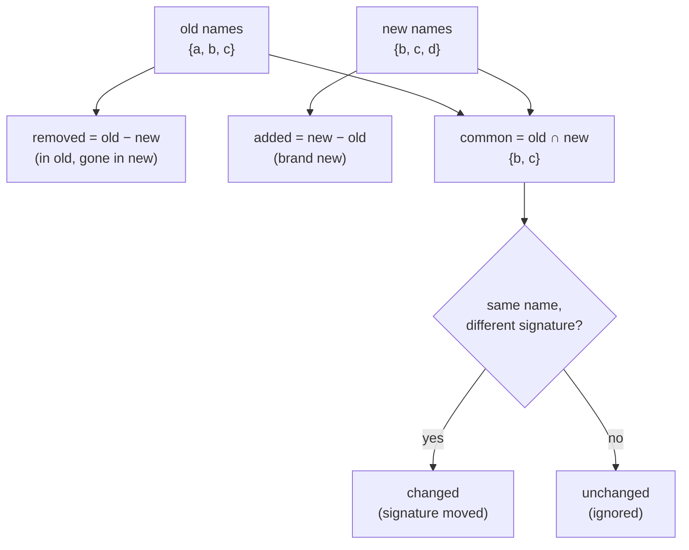

# Stage 3 — Diffing the two surfaces (`compute_diff`)

> **In one sentence:** take the old method list and the new method list and sort every method into
> one of three buckets — **added**, **removed**, or **changed** — using plain set arithmetic.
> **File:** `tools/diff_native_api.py`, section *"Diffing"* (approx. lines 516–548).

By now [stage 2](./03-surface-extraction-java-kotlin.md) has given us two `Surface` objects (old and
new), each a bag of method names. This stage is the heart of the tool — and it's surprisingly short,
because Python **sets** do almost all the work for us.

## The shape (read this first)

Think of two circles of method *names* — what's old, what's new. The overlap and the two crescents
become the three buckets.



> 🧠 **Analogy:** two class registers, last term vs this term. New faces = *added*. Empty seats =
> *removed*. Same student but a new haircut = *changed*. Everyone else = unchanged, not worth a note.

## The code, annotated

```python
def compute_diff(old: Surface, new: Surface) -> dict:
    old_names = old.names()                       # ①
    new_names = new.names()

    added_names = sorted(new_names - old_names)   # ②
    removed_names = sorted(old_names - new_names) # ③
    common_names = sorted(old_names & new_names)  # ④

    added: List[dict] = []
    for n in added_names:
        for sym in new.by_name[n]:                # ⑤
            added.append(sym.as_dict())

    removed: List[dict] = []
    for n in removed_names:
        for sym in old.by_name[n]:                # ⑤
            removed.append(sym.as_dict())

    changed: List[dict] = []
    for n in common_names:
        old_sigs = {s.signature for s in old.by_name[n]}   # ⑥
        new_sigs = {s.signature for s in new.by_name[n]}
        if old_sigs != new_sigs:                  # ⑦
            changed.append({
                "name": n,
                "old": sorted(old_sigs),
                "new": sorted(new_sigs),
                "files": sorted({s.file for s in new.by_name[n]}),   # ⑧
            })

    return {"added": added, "removed": removed, "changed": changed}  # ⑨
```

| # | What this line does | In plain English |
|---|---------------------|------------------|
| ① | `old.names()` / `new.names()` | "Get the **set** of method names present in each version." |
| ② | `new_names - old_names` | "Set difference: names in NEW but not OLD = the **added** methods." |
| ③ | `old_names - new_names` | "Set difference the other way: names in OLD but not NEW = the **removed** methods." |
| ④ | `old_names & new_names` | "Set intersection: names present in **both** = candidates for 'changed'." |
| ⑤ | `for sym in new.by_name[n]` | "A name can map to several symbols (overloads). Expand each name to its actual symbol record(s) and dump it as a dict." |
| ⑥ | `{s.signature for s in …}` | "For a shared name, gather the **set of signatures** it has in old, and in new." |
| ⑦ | `old_sigs != new_sigs` | "If the signature set differs, the method *changed* (a param added, return type moved, an overload appeared/vanished)." |
| ⑧ | `sorted({s.file for s in …})` | "List the file(s) the new version's symbol lives in — handy for the reviewer." |
| ⑨ | `return {...}` | "Hand back the three buckets as one dict — the input to the render stage." |

> ### 🟦 Beginner sidebar: what is a Python *set*, and what do `-`, `&` mean?
> A **set** is an unordered bag of unique items — perfect for "which names exist?" Sets support
> arithmetic:
> - `A - B` → items in **A but not B** (difference)
> - `A & B` → items in **both** (intersection)
> - `A | B` → items in **either** (union)
>
> So "added = new − old" and "removed = old − new" aren't loops you write by hand — they're one
> operator each. That's why this whole stage is so short. See [GLOSSARY](../../GLOSSARY.md).

> ### 🟦 Beginner sidebar: why `sorted(...)` everywhere?
> Sets have **no order**, so iterating one twice could yield items in different orders. Wrapping
> results in `sorted(...)` makes the output **deterministic** — the same SDK pair always produces an
> identical `diff.json`. That matters: it keeps git diffs of the report clean and makes runs
> reproducible. (The file's design notes call this out: "All extracted symbols are sorted by name
> for stable diffs.")

> ### 🟦 Beginner sidebar: a *set comprehension* — `{s.signature for s in …}`
> Just like the list comprehension on page 04, but with `{ }` braces, so it builds a **set** instead
> of a list. Read `{s.signature for s in old.by_name[n]}` as "the set of all signatures among the
> symbols named `n`." Duplicates collapse automatically — exactly what we want before comparing.

## Why "changed" compares *sets* of signatures, not single strings

One name can have several overloads — `pushEvent(String)` and `pushEvent(String, Map)` are two
symbols sharing the name `pushEvent`. So the tool compares the **set** of all signatures for that
name in old vs new. If an overload is added, removed, or its params shift, the sets differ and the
method lands in `changed` — with both the full old and new signature lists shown so a reviewer can
see exactly what moved.

> 🧠 Remember: this only catches what the **regex** found in stage 2 (~80%). A method the parser
> never extracted can't appear in any bucket here. That gap is the whole reason the
> [changelog recall pass](./08-changelog-crossvalidation.md) exists.

---

## ✅ Check yourself

<details>
<summary>1. Write the set expressions for "added" and "removed".</summary>

**added = new_names − old_names**, **removed = old_names − new_names**. Difference one way gives the
new arrivals, the other way gives what disappeared.
</details>

<details>
<summary>2. A method has the same name in both versions. How does the tool decide if it "changed"?</summary>

It builds the **set of signatures** for that name in old and in new, and compares them with `!=`. If
the signature sets differ (param added, overload appeared, etc.), it goes in the `changed` bucket.
</details>

<details>
<summary>3. Why is everything wrapped in <code>sorted(...)</code>?</summary>

Sets are unordered, so without sorting the output order could vary between runs. Sorting makes
`diff.json` **deterministic and reproducible** — the same inputs always yield byte-identical output.
</details>

<details>
<summary>4. A real new API is missing from <code>added</code>. Is <code>compute_diff</code> buggy?</summary>

No — `compute_diff` can only sort what stage 2 extracted. If the regex never found the method, it's
absent from both surfaces and so from every bucket. The fix/safety net is the changelog recall pass
(page 08), not this function.
</details>

**Next:** [06 — the Android build manifest (SDK levels, gradle, AndroidManifest) →](./06-build-manifest-android.md)
