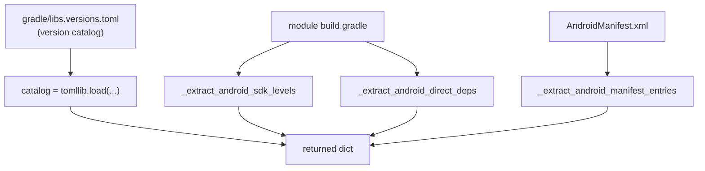
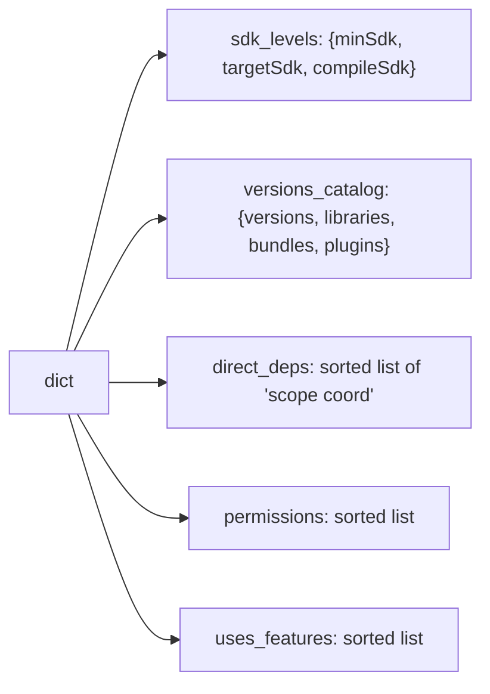

# Stage 3 (Android build) — The Android build manifest (`extract_android_build_manifest`)

> **In one sentence:** besides the API methods, a release can also change *build settings* — minimum
> Android version, dependency versions, permissions — so this reads three config files and gathers
> all of that into one dict.
> **File:** `tools/diff_native_api.py`, section *"Build manifest extraction"* (approx. lines 551–678).

A native SDK bump isn't only about methods. If the new SDK suddenly needs `minSdk 23` instead of
`21`, or pulls in a new permission, the wrapper must follow suit. This stage scrapes that info from
three files an Android module ships.

## The shape (read this first)

Three config files feed three little extractors, which combine into one returned dict.



The returned dict has this shape:



> 🧠 **Analogy:** a recipe card. The methods are the *ingredients*; the build manifest is the
> *oven settings and allergy warnings*. Both can change between editions, and both matter to anyone
> cooking from it.

## The driver: `extract_android_build_manifest`

```python
def extract_android_build_manifest(source_root: Path, module: str) -> dict:
    paths = ANDROID_MANIFEST_PATHS.get(module)        # ① which files for this module?
    if not paths:
        return {}

    toml_path = source_root / "gradle" / "libs.versions.toml"
    catalog: dict = {}
    if toml_path.exists():
        try:
            with toml_path.open("rb") as f:
                catalog = tomllib.load(f)             # ② parse the TOML version catalog
        except Exception as e:
            print(f"[diff] failed to parse {toml_path}: {e}", file=sys.stderr)

    versions = catalog.get("versions", {})            # ③ flat {snake_key: value-string}

    sdk_levels = _extract_android_sdk_levels(source_root / paths["build_gradle"], versions)  # ④
    direct_deps = _extract_android_direct_deps(source_root / paths["build_gradle"])          # ⑤
    perms, features = _extract_android_manifest_entries(source_root / paths["manifest"])     # ⑥

    return {                                          # ⑦
        "sdk_levels": sdk_levels,
        "versions_catalog": {
            "versions": versions,
            "libraries": catalog.get("libraries", {}),
            "bundles": catalog.get("bundles", {}),
            "plugins": catalog.get("plugins", {}),
        },
        "direct_deps": sorted(direct_deps),
        "permissions": sorted(perms),
        "uses_features": sorted(features),
    }
```

| # | What this line does | In plain English |
|---|---------------------|------------------|
| ① | `ANDROID_MANIFEST_PATHS.get(module)` | "Look up where this module keeps its `build.gradle` and `AndroidManifest.xml`. Unknown module → empty dict, bail out." |
| ② | `tomllib.load(f)` | "Read the version catalog `.toml` into a Python dict (see sidebar)." |
| ③ | `catalog.get("versions", {})` | "Pull the `[versions]` table — a flat map of names to version strings — defaulting to empty." |
| ④ | `_extract_android_sdk_levels(...)` | "Read minSdk/targetSdk/compileSdk from build.gradle (passing `versions` in case they're catalog refs)." |
| ⑤ | `_extract_android_direct_deps(...)` | "Read hard-coded dependency lines from build.gradle." |
| ⑥ | `_extract_android_manifest_entries(...)` | "Read `uses-permission` and `uses-feature` from the XML manifest." |
| ⑦ | `return {...}` | "Bundle all five pieces into one dict; lists are `sorted()` for stable output." |

> ### 🟦 Beginner sidebar: what is `tomllib`?
> **TOML** is a config file format (think a tidier `.ini`). Android's "version catalog"
> (`libs.versions.toml`) lists dependency versions in one place. `tomllib` is Python's **built-in**
> TOML reader (since Python 3.11) — `tomllib.load(f)` turns the file into nested dicts/lists. Note
> `open(..., "rb")`: `tomllib` insists on **binary** mode. No `pip install` needed.

> ### 🟦 Beginner sidebar: `try/except` — failing softly
> Parsing can throw (a malformed file). `try: … except Exception as e: print(...)` catches the error,
> prints a warning to `stderr`, and keeps going with an empty `catalog` instead of crashing the whole
> diff. A build-file glitch shouldn't sink the entire run.

## SDK levels — two ways they can be written

`build.gradle` might write SDK levels as plain numbers **or** as references into the version catalog,
so there are two regexes:

```python
_GRADLE_SDK_LITERAL = re.compile(
    r"^\s*(minSdk(?:Version)?|targetSdk(?:Version)?|compileSdk(?:Version)?)\s+(\d+)\b",  # A
    re.MULTILINE,
)
_GRADLE_SDK_CATALOG = re.compile(
    r"^\s*(minSdk(?:Version)?Val|targetSdk(?:Version)?Val|compileSdk(?:Version)?Val)\s*=\s*"
    r"libs\.versions\.([\w.]+)\.get\(\)\.toInteger\(\)",                                  # B
    re.MULTILINE,
)
```

```python
def _extract_android_sdk_levels(gradle_path: Path, versions: dict) -> dict:
    ...
    for m in _GRADLE_SDK_LITERAL.finditer(text):       # ① literal numbers like "minSdk 23"
        key = _normalize_sdk_key(m.group(1))
        try:
            result[key] = int(m.group(2))
        except ValueError:
            pass
    for m in _GRADLE_SDK_CATALOG.finditer(text):       # ② catalog refs like "minSdkVal = libs.versions.android.minSdk.get()..."
        key_raw = m.group(1).replace("Val", "")
        key = _normalize_sdk_key(key_raw)
        if key in result:                              # ③ literal wins if already found
            continue
        catalog_path = m.group(2)                      # e.g. "android.minSdk"
        toml_key = catalog_path.replace(".", "_")      # ④ "android.minSdk" → "android_minSdk"
        val = versions.get(toml_key)
        if val is not None:
            try:
                result[key] = int(val)
            except (ValueError, TypeError):
                pass
    return result
```

| # | What this line does | In plain English |
|---|---------------------|------------------|
| ① | literal pass | "Find SDK levels written as bare numbers (`minSdk 23`) and store them as ints." |
| ② | catalog pass | "Find SDK levels written as catalog lookups (`libs.versions.android.minSdk.get()...`) and resolve them via the `versions` dict." |
| ③ | `if key in result: continue` | "A literal already found wins — don't overwrite it with a catalog value." |
| ④ | `.replace(".", "_")` | "Catalog paths use dots (`android.minSdk`); the TOML `[versions]` keys use underscores — convert before lookup." |

```python
def _normalize_sdk_key(raw: str) -> str:
    raw = raw.replace("Version", "")
    if raw.startswith("minSdk"):     return "minSdk"
    if raw.startswith("targetSdk"):  return "targetSdk"
    if raw.startswith("compileSdk"): return "compileSdk"
    return raw
```

`_normalize_sdk_key` squashes all the spellings — `minSdk`, `minSdkVersion` — into one canonical key
(`minSdk`), so the diff doesn't see two different names for the same setting.

> ### 🟦 Beginner sidebar: `(?:minSdk(?:Version)?)` — optional groups in regex
> `(?:Version)?` is a **non-capturing optional group**: it matches `Version` if present, otherwise
> nothing. So one pattern matches both `minSdk` *and* `minSdkVersion`. The `(?:…)` doesn't create a
> numbered group; the `?` means "zero or one." (Regex refresher: see page 03's cheat-sheet.)

## Direct dependencies

```python
_GRADLE_DIRECT_DEP = re.compile(
    r"^\s*(api|implementation|compileOnly|testImplementation|androidTestImplementation)\s+"
    r"['\"]([^'\"]+:[^'\"]+:[^'\"]+)['\"]",
    re.MULTILINE,
)

def _extract_android_direct_deps(gradle_path: Path) -> Set[str]:
    ...
    for m in _GRADLE_DIRECT_DEP.finditer(text):
        scope = m.group(1)          # e.g. "implementation"
        coord = m.group(2)          # e.g. "androidx.core:core:1.12.0"
        out.add(f"{scope} {coord}")
    return out
```

This matches lines like `implementation "androidx.core:core:1.12.0"` — a **scope** word followed by a
quoted `group:artifact:version` coordinate (three colon-separated parts) — and records `"scope
coord"`. These are the *hard-coded* deps, separate from catalog-managed ones.

## Permissions & features — XML, not regex

```python
def _extract_android_manifest_entries(manifest_path: Path) -> Tuple[Set[str], Set[str]]:
    ...
    try:
        tree = ET.parse(manifest_path)               # ① parse the XML
    except ET.ParseError as e:
        print(f"[diff] failed to parse {manifest_path}: {e}", file=sys.stderr)
        return set(), set()
    root = tree.getroot()
    ns = "{http://schemas.android.com/apk/res/android}"          # ② the android: namespace
    perms = {el.get(f"{ns}name", "") for el in root.iter("uses-permission")} - {""}   # ③
    feats = {el.get(f"{ns}name", "") for el in root.iter("uses-feature")} - {""}      # ③
    return perms, feats
```

| # | What this line does | In plain English |
|---|---------------------|------------------|
| ① | `ET.parse(manifest_path)` | "Parse `AndroidManifest.xml` *properly* as XML (not regex) — it's structured, so use a real parser." |
| ② | the `ns` string | "Android attributes live in a namespace; the real attribute name is `{http://…}name`, not just `name`." |
| ③ | set comprehension `- {""}` | "Collect every `<uses-permission>`'s `android:name` into a set, then drop any empty string." |

> ### 🟦 Beginner sidebar: what is ElementTree / XML parsing?
> `ET` is `xml.etree.ElementTree`, Python's built-in XML reader. `ET.parse(file).getroot()` gives the
> root element; `root.iter("uses-permission")` walks **every** `<uses-permission>` tag anywhere in
> the tree; `el.get(name)` reads an attribute. Unlike regex, it understands nesting and namespaces —
> the right tool for structured XML. The `{http://…}name` prefix is how ElementTree spells a
> **namespaced** attribute (Android's `android:name`).

---

## ✅ Check yourself

<details>
<summary>1. Which three files does this stage read, and what does each contribute?</summary>

**`libs.versions.toml`** → the version catalog; **module `build.gradle`** → SDK levels + direct
dependencies; **`AndroidManifest.xml`** → permissions + features. They merge into one returned dict.
</details>

<details>
<summary>2. Why are there two SDK-level regexes, and which one wins on a tie?</summary>

Because `build.gradle` can write levels as **literal numbers** or as **catalog references**. The
literal value wins — `if key in result: continue` skips the catalog pass for a key already found.
</details>

<details>
<summary>3. Why parse <code>AndroidManifest.xml</code> with ElementTree instead of regex?</summary>

It's structured XML with namespaces and nesting. A real XML parser reads attributes reliably (e.g.
the namespaced `android:name`), where regex would be fragile and miss edge cases.
</details>

<details>
<summary>4. The catalog path is <code>android.minSdk</code> but the TOML key is <code>android_minSdk</code>. Where's that handled?</summary>

In `_extract_android_sdk_levels`: `toml_key = catalog_path.replace(".", "_")` converts dots to
underscores before looking the value up in the `versions` dict.
</details>

**Next:** [07 — the iOS build manifest (the podspec) →](./07-build-manifest-ios.md)
