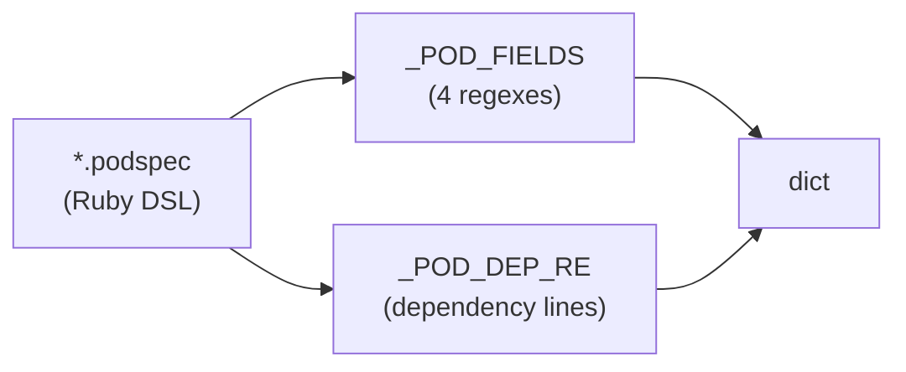
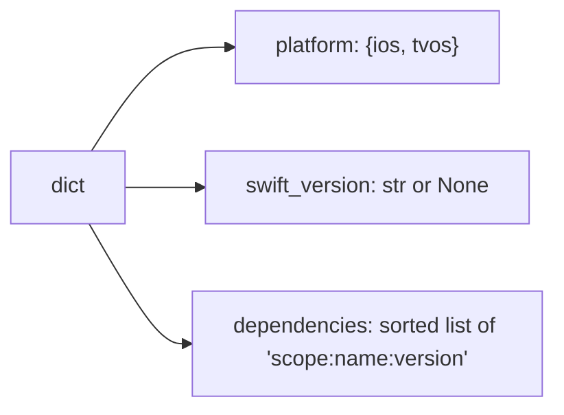

# Stage 3 (iOS build) — The iOS build manifest (`extract_ios_build_manifest`)

> **In one sentence:** iOS keeps its build settings in one `.podspec` file, so this reads four fields
> (platform versions, Swift version) and the pod dependencies out of it.
> **File:** `tools/diff_native_api.py`, section *"iOS podspec extraction"* (approx. lines 679–734)
> and *"Build-manifest diff"* (approx. lines 916–943).

This is the iOS counterpart to [page 06](./06-build-manifest-android.md). Android scattered its build
config across three files; iOS is simpler — a single **podspec** holds it all. The trade-off is that
a podspec is a Ruby file, so we scrape it with regex rather than a real parser.

## The shape (read this first)

One file in, one dict out:



The returned dict has this shape:



> 🧠 **Analogy:** the podspec is the SDK's *passport* — one document listing which OS versions it's
> allowed into (deployment targets), what language it speaks (Swift version), and who it travels with
> (dependencies).

## The fields it looks for

```python
_POD_FIELDS = {
    "platform_ios":        re.compile(r"^\s*s\.platform\s*=\s*:ios\s*,\s*['\"]([\d.]+)['\"]", re.MULTILINE),
    "platform_ios_target": re.compile(r"^\s*s\.ios\.deployment_target\s*=\s*['\"]([\d.]+)['\"]", re.MULTILINE),
    "platform_tvos":       re.compile(r"^\s*s\.tvos\.deployment_target\s*=\s*['\"]([\d.]+)['\"]", re.MULTILINE),
    "swift_version":       re.compile(r"^\s*s\.swift_version\s*=\s*['\"]([\d.]+)['\"]", re.MULTILINE),
}

_POD_DEP_RE = re.compile(
    r"^\s*s(?:\.(ios|tvos|osx|watchos))?\.dependency\s+['\"]([^'\"]+)['\"]"
    r"(?:\s*,\s*['\"]([^'\"]+)['\"])?",
    re.MULTILINE,
)
```

`_POD_FIELDS` is a **dict of regexes**, one per setting. Each captures a `[\d.]+` version string out
of a line like `s.ios.deployment_target = '12.0'`. `_POD_DEP_RE` matches a `s.dependency
'Name', '1.2.0'` line — capturing an optional scope (`ios`/`tvos`/…), the dependency name, and an
optional version.

> ### 🟦 Beginner sidebar: what is a podspec, and why regex (not a parser)?
> A `.podspec` is a CocoaPods spec — actually **Ruby code** that sets attributes on a spec object
> `s` (hence `s.platform`, `s.dependency`). Python has no built-in Ruby evaluator, and we only want
> a handful of fields, so the tool matches those specific lines with [regex](../../GLOSSARY.md). It's
> the same ~80% best-effort philosophy as the API extractor: cheap, good enough, engineer triages
> the rest.

## The driver: `extract_ios_build_manifest`

```python
def extract_ios_build_manifest(source_root: Path, module: str) -> dict:
    podspec_rel = IOS_PODSPEC_PATHS.get(module)        # ① which podspec for this module?
    if not podspec_rel:
        return {}
    path = source_root / podspec_rel
    if not path.exists():
        return {"_warning": f"podspec not found at {podspec_rel}"}   # ②

    text = path.read_text(encoding="utf-8", errors="replace")

    platform: Dict[str, str] = {}
    for key, rx in _POD_FIELDS.items():                # ③ run each field regex
        m = rx.search(text)
        if not m:
            continue
        if key == "platform_ios":
            platform["ios"] = m.group(1)
        elif key == "platform_ios_target":
            platform["ios"] = m.group(1)               # ④ deployment_target overrides s.platform
        elif key == "platform_tvos":
            platform["tvos"] = m.group(1)

    swift_version_match = _POD_FIELDS["swift_version"].search(text)
    swift_version = swift_version_match.group(1) if swift_version_match else None   # ⑤

    deps: Set[str] = set()
    for m in _POD_DEP_RE.finditer(text):               # ⑥ collect dependencies
        scope = m.group(1) or "all"
        name = m.group(2)
        version = m.group(3) or ""
        deps.add(f"{scope}:{name}:{version}".rstrip(":"))   # ⑦

    return {                                           # ⑧
        "platform": platform,
        "swift_version": swift_version,
        "dependencies": sorted(deps),
    }
```

| # | What this line does | In plain English |
|---|---------------------|------------------|
| ① | `IOS_PODSPEC_PATHS.get(module)` | "Look up the podspec path for this module. Unknown → empty dict." |
| ② | the `_warning` return | "If the podspec isn't where we expect, return a warning marker instead of crashing — the reviewer sees the gap." |
| ③ | loop over `_POD_FIELDS` | "Run each field's regex against the text; skip fields that don't appear." |
| ④ | `deployment_target overrides` | "If both `s.platform :ios, '11.0'` and `s.ios.deployment_target '12.0'` exist, the explicit deployment_target wins." |
| ⑤ | `... if … else None` | "Swift version is optional — record it, or `None` if absent." |
| ⑥ | `_POD_DEP_RE.finditer` | "Walk every dependency line in the podspec." |
| ⑦ | `f"{scope}:{name}:{version}".rstrip(":")` | "Format as `scope:name:version`; `.rstrip(':')` trims a trailing colon when the version is blank." |
| ⑧ | `return {...}` | "Hand back platform targets, swift version, and a sorted dependency list." |

> ### 🟦 Beginner sidebar: `x or "default"` and `... if cond else None`
> `m.group(1) or "all"` means "use group 1, but if it's empty/`None`, use `"all"`." It's Python's
> handy fallback idiom. And `value if condition else None` is a **conditional expression** (a
> one-line if/else) — here "the matched version, otherwise `None`." Both keep the code compact and
> tolerant of missing fields.

## How the iOS build diff is computed: `_diff_ios_build`

After extracting old and new podspec manifests, this compares them (called via `compute_build_diff`):

```python
def _diff_ios_build(old: dict, new: dict) -> dict:
    platform_diff: Dict[str, dict] = {}
    o_plat = old.get("platform", {}) or {}
    n_plat = new.get("platform", {}) or {}
    for key in set(o_plat) | set(n_plat):              # ① every platform key in either side
        if o_plat.get(key) != n_plat.get(key):
            platform_diff[key] = {"old": o_plat.get(key), "new": n_plat.get(key)}

    swift_diff = None
    if old.get("swift_version") != new.get("swift_version"):    # ② scalar compare
        swift_diff = {"old": old.get("swift_version"), "new": new.get("swift_version")}

    o_deps = set(old.get("dependencies", []))
    n_deps = set(new.get("dependencies", []))
    deps_diff = {
        "added": sorted(n_deps - o_deps),              # ③ same set-difference trick as page 05
        "removed": sorted(o_deps - n_deps),
    }
    if not deps_diff["added"] and not deps_diff["removed"]:
        deps_diff = {}                                 # ④ empty if nothing changed

    return {
        "platform": platform_diff,
        "swift_version": swift_diff,
        "dependencies": deps_diff,
    }
```

| # | What this line does | In plain English |
|---|---------------------|------------------|
| ① | `set(o_plat) \| set(n_plat)` | "Union the platform keys from both sides so we notice a target added *or* removed, then flag any that differ." |
| ② | swift compare | "If the Swift version string changed, record old → new; otherwise leave it `None`." |
| ③ | `n_deps - o_deps` / `o_deps - n_deps` | "The exact added/removed set arithmetic from [page 05](./05-diffing.md), applied to pod dependencies." |
| ④ | reset to `{}` | "If nothing was added or removed, collapse to an empty dict so the report can simply skip the section." |

> 🧠 Notice the **same set-difference pattern** as method diffing and Android deps. Once you've seen
> `new − old` = added and `old − new` = removed once, you recognize it everywhere in this tool.

---

## ✅ Check yourself

<details>
<summary>1. Why does iOS read one file while Android reads three?</summary>

iOS keeps platform targets, Swift version, and dependencies all in a single **`.podspec`**. Android
spreads the same concerns across `libs.versions.toml`, `build.gradle`, and `AndroidManifest.xml`.
</details>

<details>
<summary>2. A podspec has both <code>s.platform :ios, '11.0'</code> and <code>s.ios.deployment_target '12.0'</code>. Which iOS version is recorded?</summary>

**12.0** — `platform_ios_target` (the explicit `deployment_target`) overrides the `s.platform`
value, because its branch runs and overwrites `platform["ios"]`.
</details>

<details>
<summary>3. Why is the podspec scraped with regex instead of a proper parser?</summary>

A podspec is a Ruby file; Python can't evaluate Ruby, and only a few fields are needed. Regex on the
specific lines is the cheap, good-enough approach — accepting the same ~80% best-effort trade-off as
the API extractor.
</details>

<details>
<summary>4. How does <code>_diff_ios_build</code> decide which dependencies were added vs removed?</summary>

The same set arithmetic as everywhere: `added = new_deps − old_deps`, `removed = old_deps −
new_deps`, both `sorted()`. If both are empty, the dependency diff collapses to `{}`.
</details>

**Next:** [08 — the changelog recall pass (catching the ~20% the regex misses) →](./08-changelog-crossvalidation.md)
