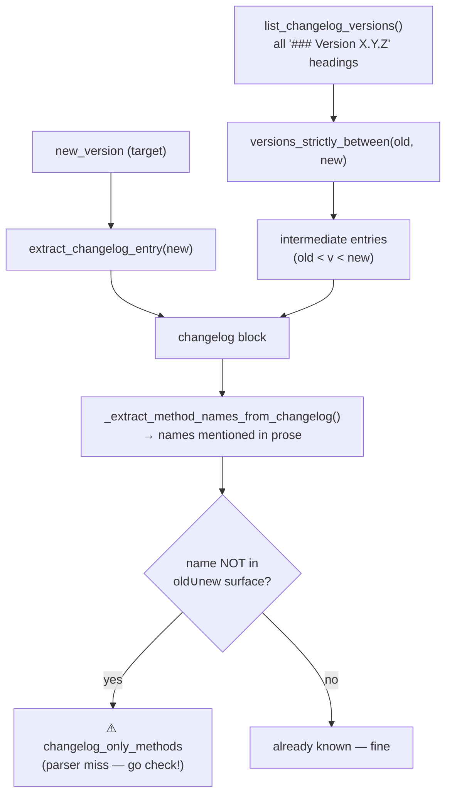
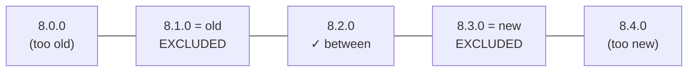

# Stage 3 (recall pass) — Changelog cross-validation (the ~20% safety net)

> **In one sentence:** the regex parser only catches ~80% of API changes, so this stage re-reads the
> SDK's own CHANGELOG — including every version *between* old and new — and flags any method the
> changelog names but the structural diff missed.
> **File:** `tools/diff_native_api.py`, sections *"Changelog cross-validation"* (approx. lines
> 281–300, 735–835).

**This is the most important page in the walkthrough.** Everything before it — Java/Kotlin/Obj-C
extraction, set diffing — is *precision*: it reports exactly what it parsed. But parsing with regex
[misses ~20%](../../00-primer/02-the-4-layer-onion.md) (wrapped declarations, generated overloads,
weird formatting). This stage adds **recall**: a second, independent read of the human-written
changelog that catches what the parser dropped. Precision says "here's what I'm sure changed";
recall says "...and here are names the changelog mentions that I never saw — go check."

## The shape (read this first)

For a sync like `8.1.0 → 8.3.0`, we want the target entry **and** every intermediate version's entry
(so a version-skipping bump still surfaces what `8.2.0` said).



Here's `versions_strictly_between` on a number line — only the open interval `(old, new)` is kept:



> 🧠 **Analogy:** the parser is a metal detector sweeping the beach — fast, but it misses anything
> non-metal. The changelog recall pass is then **reading the lifeguard's logbook**: "we also buried a
> wooden chest near the pier." If your detector never beeped on it, that's exactly the thing to dig
> up by hand.

## Finding version headings: `_CHANGELOG_HEADING` + `list_changelog_versions`

```python
_CHANGELOG_HEADING = re.compile(
    r"^###\s+\[?Version\s+(\d+\.\d+\.\d+(?:[.\w]*)?)\b",     # ①
    re.MULTILINE | re.IGNORECASE,
)

def list_changelog_versions(source_root: Path, platform: str, module: str) -> List[str]:
    rel = CHANGELOG_PATHS.get((platform, module))
    if not rel:
        return []
    path = source_root / rel
    if not path.exists():
        return []
    text = path.read_text(encoding="utf-8", errors="replace")
    return [m.group(1) for m in _CHANGELOG_HEADING.finditer(text)]   # ②
```

| # | What this line does | In plain English |
|---|---------------------|------------------|
| ① | the heading regex | "Match a markdown heading like `### Version 8.2.0` (the `[?` allows the linked form `### [Version 8.2.0](...)`); capture the version number." |
| ② | `[m.group(1) for m in …finditer]` | "Return every version string that has a heading, in the order they appear in the file." |

## Comparing versions: `_parse_version` + `versions_strictly_between`

```python
def _parse_version(s: str) -> Tuple[int, ...]:
    """Best-effort semver parse; falls back to leading-int tuple."""
    parts = re.findall(r"\d+", s)                      # ① pull out all number groups
    return tuple(int(p) for p in parts) if parts else (0,)   # ② make a tuple of ints

def versions_strictly_between(versions: List[str], old: str, new: str) -> List[str]:
    old_t = _parse_version(old)
    new_t = _parse_version(new)
    out: List[str] = []
    for v in versions:
        vt = _parse_version(v)
        if old_t < vt < new_t:                         # ③ strict: old < v < new
            out.append(v)
    return out
```

| # | What this line does | In plain English |
|---|---------------------|------------------|
| ① | `re.findall(r"\d+", s)` | "Find every run of digits in the version string: `'8.2.0'` → `['8','2','0']`." |
| ② | `tuple(int(p) for p in parts)` | "Turn them into a tuple of ints: `(8, 2, 0)`. Tuples compare left-to-right like version numbers do." |
| ③ | `old_t < vt < new_t` | "Keep `v` only if it's strictly **between** old and new — endpoints excluded (they're not 'intermediate')." |

> ### 🟦 Beginner sidebar: why turn a version into a *tuple of ints*?
> Comparing version **strings** is wrong: `"8.10.0" < "8.9.0"` is `True` alphabetically (because `'1'`
> < `'9'`)! But the **tuples** `(8, 10, 0)` vs `(8, 9, 0)` compare element-by-element like real
> numbers, so `(8, 9, 0) < (8, 10, 0)` is correctly `True`. That's why `_parse_version` converts to
> `(int, int, int)` first. Tuple comparison is left-to-right: compare the first items; if tied, the
> next; and so on. See [GLOSSARY](../../GLOSSARY.md).

## Extracting one entry: `extract_changelog_entry`

```python
def extract_changelog_entry(source_root, platform, module, version) -> Optional[dict]:
    ...
    pattern = re.compile(
        rf"^###\s+\[?Version\s+{re.escape(version)}\b.*?(?=^###\s+\[?Version\b|\Z)",   # ①
        re.MULTILINE | re.DOTALL | re.IGNORECASE,
    )
    m = pattern.search(text)
    if not m:
        return {"version": version, "entry": None,
                "_warning": f"no '### Version {version}' section found in {rel}"}      # ②
    return {"version": version, "entry": m.group(0).strip()}                          # ③
```

| # | What this line does | In plain English |
|---|---------------------|------------------|
| ① | the section regex | "Grab everything from this version's heading up to (but not including) the **next** version heading — or end of file (`\Z`). `re.escape` makes the version safe to drop into the pattern." |
| ② | `_warning` return | "No section found → return a marker so the reviewer knows the changelog didn't mention this version." |
| ③ | `m.group(0).strip()` | "Return the whole captured block of changelog prose for that version." |

> ### 🟦 Beginner sidebar: lookahead `(?=…)` and `\Z`, plus `re.escape`
> `(?=^###\s+\[?Version\b|\Z)` is a **lookahead** — "stop right before the next `### Version` heading,
> or before end-of-text `\Z`" — without consuming it, so the next entry stays available. `re.escape`
> turns characters like `.` in `8.2.0` into literals so they're matched exactly, not as regex
> wildcards. The `rf"..."` prefix is a string that is **both** an f-string (so `{version}` is
> substituted) and a raw string (so `\s` stays a regex token).

## Assembling the block: `extract_changelog_block`

```python
def extract_changelog_block(source_root, platform, module, old_version, new_version) -> dict:
    target = extract_changelog_entry(source_root, platform, module, new_version)      # ①
    all_versions = list_changelog_versions(source_root, platform, module)             # ②
    intermediates_versions = versions_strictly_between(all_versions, old_version, new_version)  # ③

    intermediates: List[dict] = []
    for v in intermediates_versions:
        entry = extract_changelog_entry(source_root, platform, module, v)             # ④
        if entry and entry.get("entry"):
            intermediates.append({"version": v, "entry": entry["entry"]})

    return {                                                                          # ⑤
        "target_version": new_version,
        "target_entry": target.get("entry") if target else None,
        "intermediate_entries": intermediates,
    }
```

| # | What this line does | In plain English |
|---|---------------------|------------------|
| ① | target entry | "Grab the new (target) version's changelog section." |
| ② | all versions | "List every version heading in the file." |
| ③ | strictly-between | "Filter to versions between old and new — the ones a skipping bump would otherwise hide." |
| ④ | per-intermediate entry | "Pull each intermediate version's section too." |
| ⑤ | `return {...}` | "Bundle target + intermediates into one block for rendering and the recall cross-check." |

> ### 🟦 Beginner sidebar: why read intermediate versions at all?
> A sync often jumps versions: `8.1.0 → 8.3.0`. The change you care about might have shipped in
> `8.2.0`. Because the **new** version's CHANGELOG file keeps the historical entries, the tool can
> read that one file and pull out `8.2.0`'s section too — so reviewers see the *full* release
> narrative, not just the endpoints.

## The recall regexes: `_extract_method_names_from_changelog`

These turn changelog prose into a set of method names to cross-check:

```python
_CHANGELOG_METHOD_CALL = re.compile(r"^\s*([a-z][a-zA-Z0-9_]*)\s*\(")   # backticked `name(...)`
_CHANGELOG_OBJC_SELECTOR = re.compile(r"^\s*([a-z][a-zA-Z0-9_]*)\s*:")  # backticked `name:` selector

def _extract_method_names_from_changelog(text: str) -> Set[str]:
    names: Set[str] = set()
    if not text:
        return names
    for backticked in re.findall(r"`([^`]+)`", text):    # ① every `…` snippet
        m = _CHANGELOG_METHOD_CALL.match(backticked)     # ② looks like a method call?
        if m:
            names.add(m.group(1))
            continue
        m = _CHANGELOG_OBJC_SELECTOR.match(backticked)   # ③ or an Obj-C selector?
        if m:
            names.add(m.group(1))
    return names
```

| # | What this line does | In plain English |
|---|---------------------|------------------|
| ① | `re.findall(r"`([^`]+)`", text)` | "Pull out every backtick-quoted snippet — changelogs write code things in backticks." |
| ② | `_CHANGELOG_METHOD_CALL` | "Does the snippet look like `methodName(`? (lowercase-first, to skip class names.) Keep the name." |
| ③ | `_CHANGELOG_OBJC_SELECTOR` | "Or does it look like `selector:`? Keep that name too." |

The orchestrator ([page 10](./10-main-orchestration.md)) then computes
`changelog_only_methods = changelog_mentioned − (new_surface ∪ old_surface)` and prints a `⚠️`
warning for any name the changelog talks about but neither surface contains — **the parser misses,
made visible.**

> 🧠 **Why "lowercase-first"?** `_CHANGELOG_METHOD_CALL` requires `[a-z]` at the start. Java/Kotlin
> *methods* are conventionally lowerCamelCase (`recordEvent`), while *classes* are UpperCamelCase
> (`CleverTapAPI`). Anchoring on lowercase filters out class names mentioned in the changelog so
> they don't masquerade as missed methods.

> ### 🟦 Beginner sidebar: precision vs recall (the whole point)
> **Precision** = "of what I reported, how much is correct?" The structural diff is high-precision —
> it only lists what it actually parsed. **Recall** = "of everything that truly changed, how much did
> I find?" Regex parsing has imperfect recall (~80%). This changelog pass is a **recall booster**: an
> independent second source that surfaces names the parser dropped, so a human catches the gap before
> it ships. Two different methods agreeing is far safer than trusting one.

---

## ✅ Check yourself

<details>
<summary>1. The diff tool catches ~80% of API changes. What is this page's job for the other ~20%?</summary>

It's the **recall pass**: re-read the human-written CHANGELOG, extract method names mentioned in
prose, and flag any that the structural (regex) diff never found. Those become
`changelog_only_methods` — a `⚠️` for the engineer to investigate.
</details>

<details>
<summary>2. Why convert version strings to tuples of ints before comparing?</summary>

String comparison is wrong for versions (`"8.10.0" < "8.9.0"` alphabetically). Tuples like
`(8, 10, 0)` compare numerically element-by-element, so ordering and "strictly between" work
correctly.
</details>

<details>
<summary>3. For a <code>8.1.0 → 8.3.0</code> sync, which changelog entries are gathered, and why?</summary>

The **target** (8.3.0) **plus** every version strictly between (here 8.2.0). Syncs often skip
versions; reading intermediates surfaces changes that landed in a skipped release.
</details>

<details>
<summary>4. Why does <code>_CHANGELOG_METHOD_CALL</code> require a lowercase first letter?</summary>

To skip class names. Methods are lowerCamelCase (`recordEvent`), classes UpperCamelCase
(`CleverTapAPI`). Anchoring on `[a-z]` keeps the recall set to likely *methods*, not types.
</details>

**Next:** [09 — rendering the output (diff.json + diff.md) →](./09-output-rendering.md)
