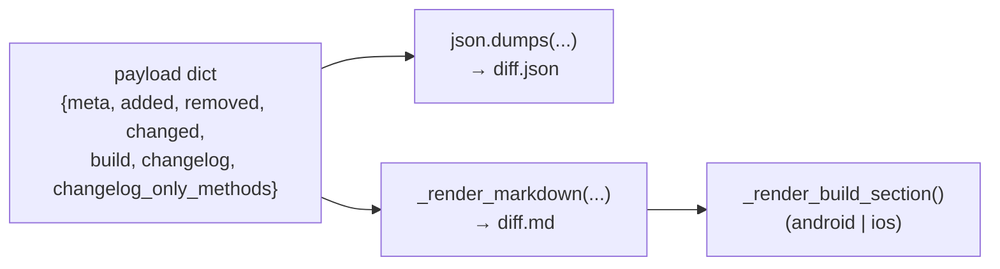

# Stage 4 — Rendering the output (`write_outputs`, `_render_markdown`)

> **In one sentence:** take the assembled diff data and write it twice — once as `diff.json` for the
> machine and once as `diff.md` as a human-readable report.
> **File:** `tools/diff_native_api.py`, section *"Output"* (approx. lines 944–1177).

All the hard thinking is done. This last stage is pure presentation: one payload dict goes in, two
files come out. There's no new logic to puzzle over — just two different *views* of the same data.

## The shape (read this first)

One payload dict fans out into two files:



> 🧠 **Analogy:** the same spreadsheet exported two ways — a raw `.csv` for another program to import
> (`diff.json`), and a formatted PDF report for a person to read (`diff.md`). Same numbers, two
> audiences.

## The entry point: `write_outputs`

```python
def write_outputs(diff: dict, meta: dict, out_dir: Path) -> Tuple[Path, Path]:
    out_dir.mkdir(parents=True, exist_ok=True)        # ①
    json_path = out_dir / "diff.json"
    md_path = out_dir / "diff.md"

    payload = {"meta": meta, **diff}                  # ②
    json_path.write_text(json.dumps(payload, indent=2, sort_keys=True))   # ③

    md = _render_markdown(payload)                    # ④
    md_path.write_text(md)

    return json_path, md_path                         # ⑤
```

| # | What this line does | In plain English |
|---|---------------------|------------------|
| ① | `out_dir.mkdir(parents=True, exist_ok=True)` | "Make the output folder, creating parents as needed, no error if it already exists." |
| ② | `{"meta": meta, **diff}` | "Build one payload: the `meta` block plus everything in `diff` (added/removed/changed/build/changelog…) spread in." |
| ③ | `json.dumps(payload, indent=2, sort_keys=True)` | "Serialize to pretty JSON — indented and key-sorted so the file is stable and git-diff-friendly." |
| ④ | `_render_markdown(payload)` | "Render the same payload as a Markdown report." |
| ⑤ | `return json_path, md_path` | "Hand both file paths back to `main()` so it can print where it wrote them." |

> ### 🟦 Beginner sidebar: what is JSON, and what do `indent`/`sort_keys` do?
> **JSON** is a universal text format for nested data (dicts/lists/strings/numbers). `json.dumps`
> turns a Python dict into a JSON string. `indent=2` pretty-prints it (2-space nesting) so humans can
> read it; `sort_keys=True` orders keys alphabetically so the **same data always produces the same
> bytes** — deterministic, just like the `sorted(...)` calls back in [diffing](./05-diffing.md). The
> machine readers (the next layers of the system) consume this file.

> ### 🟦 Beginner sidebar: `{**diff}` — dict unpacking
> `{"meta": meta, **diff}` uses the `**` **spread** operator: it copies every key/value from `diff`
> into the new dict, alongside `meta`. So if `diff` has `added`, `removed`, `changed`, they all land
> at the top level next to `meta`. It's the dict version of "pour these in too."

## Building the report: `_render_markdown`

This is long but mechanical — it just appends strings to a `lines` list and joins them at the end.
Trimmed to show the pattern:

```python
def _render_markdown(payload: dict) -> str:
    meta = payload["meta"]
    added = payload["added"]
    removed = payload["removed"]
    changed = payload["changed"]

    lines: List[str] = []
    lines.append(f"# Native API diff: {meta['platform']}/{meta['module']} "
                 f"{meta['old_version']} → {meta['new_version']}")        # ① title
    ...
    lines.append(f"- Added: **{len(added)}**, Removed: **{len(removed)}**, Changed: **{len(changed)}**")
    ...
    if added:                                                            # ② a section per bucket
        lines.append("## Added")
        lines.append("| Name | Kind | File |")
        lines.append("|---|---|---|")
        for s in added:
            lines.append(f"| `{s['name']}` | {s['kind']} | `{s['file']}` |")
    ...
    if changed:                                                          # ③ old → new signatures
        lines.append("## Changed signatures")
        for c in changed:
            lines.append(f"### `{c['name']}`")
            lines.append("Old:")
            for sig in c["old"]:
                lines.append(f"- `{sig}`")
            lines.append("New:")
            for sig in c["new"]:
                lines.append(f"- `{sig}`")
    ...
    if not (added or removed or changed):                                # ④ the "nothing changed" note
        lines.append("_No public-surface changes detected._")
    ...
    build = payload.get("build") or {}                                   # ⑤ build section
    if build:
        lines.append("## Build manifest changes")
        _render_build_section(lines, build, meta["platform"])

    changelog = payload.get("changelog")                                 # ⑥ changelog panel
    if changelog:
        ...
        lines.append(f"## Changelog — target version {target_version}")
        ...
        if intermediates:
            lines.append(f"## Changelog — intermediate versions ({len(intermediates)})")
            ...
    return "\n".join(lines)                                              # ⑦ glue into one string
```

| # | What this line does | In plain English |
|---|---------------------|------------------|
| ① | title line | "Headline the report: `# Native API diff: android/core 8.1.0 → 8.2.0`." |
| ② | `if added:` table | "Only emit an 'Added' section (a Markdown table) if there's something to show." |
| ③ | changed loop | "For each changed method, list its old signature(s) then its new signature(s) so a reviewer sees exactly what moved." |
| ④ | empty-state note | "If all three buckets are empty, print a friendly 'no changes' explanation instead of blank tables." |
| ⑤ | build section | "If there's a build diff, add a heading and hand off to `_render_build_section`." |
| ⑥ | changelog panel | "Append the target version's changelog, then any intermediate-version changelogs." |
| ⑦ | `"\n".join(lines)` | "Join the accumulated lines with newlines into the final Markdown string." |

> ### 🟦 Beginner sidebar: the "append to a list, then join" pattern
> Building a big string by `s += "..."` over and over is slow and messy. The idiomatic way is: make a
> `lines = []`, `lines.append(...)` each line, then `"\n".join(lines)` once at the end. It's faster
> and far easier to read — you'll see this pattern in tons of Python that emits text reports.

> ### 🟦 Beginner sidebar: f-strings building Markdown
> Lines like `f"| `{s['name']}` | {s['kind']} | `{s['file']}` |"` are **f-strings** producing a
> Markdown table row. The backticks are literal Markdown (inline code); the `{...}` parts are
> substituted from the data. So the *data* dict becomes *formatted text* one row at a time.

## Per-platform build details: `_render_build_section`

```python
def _render_build_section(lines: List[str], build: dict, platform: str) -> None:
    build = build.get(platform) or {}                 # ① dig into the active platform
    if platform == "android":
        sdk = build.get("sdk_levels") or {}
        if sdk:
            lines.append("### SDK levels")
            lines.append("| Key | Old | New |")
            ...
        # ... versions catalog, direct deps, permissions, uses-features ...
        if not any([sdk, cat, dd, perms, feats]):
            lines.append("_No Android build-manifest changes detected._")
    elif platform == "ios":
        plat = build.get("platform") or {}
        # ... platform targets, swift version, pod dependencies ...
        if not any([plat, swift, deps]):
            lines.append("_No iOS build-manifest changes detected._")
```

| # | What this line does | In plain English |
|---|---------------------|------------------|
| ① | `build.get(platform)` | "The build envelope is `{android: {...}, ios: {...}}`. Pick the branch for the platform we actually ran." |

Notice it takes `lines` as a parameter and **appends to it in place** (returns `None`) — it's
contributing to the same growing report `_render_markdown` is building, rather than making its own
string. The Android branch renders SDK levels, the version catalog (added/removed/changed), direct
deps, permissions, and features; the iOS branch renders platform targets, Swift version, and pod
deps. Each sub-section only appears if it has content, and an explicit "_No … changes detected._"
line covers the empty case.

> 🧠 The whole render stage never *decides* anything — every "is this added or changed?" question was
> already answered upstream. Rendering only **formats**. That separation (compute, then present) is
> why this file is easy to extend: a new output format would only touch this stage.

---

## ✅ Check yourself

<details>
<summary>1. What two files does <code>write_outputs</code> produce, and who's each for?</summary>

**`diff.json`** (machine-readable, for the downstream layers that consume it) and **`diff.md`**
(human-readable report for a reviewer). Same payload, two views.
</details>

<details>
<summary>2. Why <code>json.dumps(..., indent=2, sort_keys=True)</code>?</summary>

`indent=2` makes the JSON readable; `sort_keys=True` makes the output **deterministic** — identical
inputs yield byte-identical files, keeping git diffs and reruns clean.
</details>

<details>
<summary>3. <code>_render_build_section</code> returns <code>None</code> but still "produces" output. How?</summary>

It receives the shared `lines` list and **appends to it in place**, contributing to the report
`_render_markdown` is assembling. No return value is needed.
</details>

<details>
<summary>4. Does the render stage ever decide whether something is "added" or "changed"?</summary>

No. All that was computed upstream (diffing, build diff, changelog). Rendering only **formats** the
already-decided data — a clean compute-then-present split.
</details>

**Next:** [10 — main(): wiring all four stages together →](./10-main-orchestration.md)
