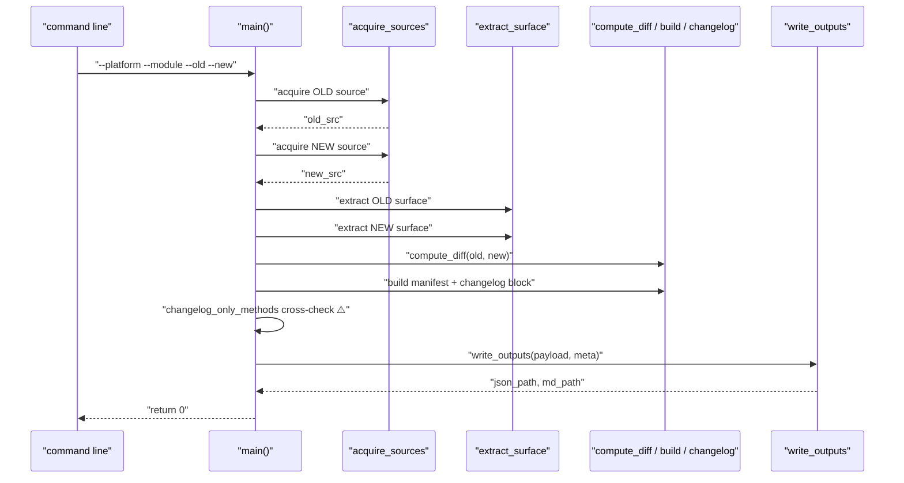

# The conductor — `main()` wires all four stages together

> **In one sentence:** read the command-line options, then call the four stages — acquire → extract →
> diff → render — in order, with the changelog recall cross-check stitched in just before output.
> **File:** `tools/diff_native_api.py`, section *"Main"* (approx. lines 1178–1307).

You've now seen every station on the assembly line. This page is the **conductor** that runs them in
order. It's mostly plumbing — but it's where the [overview's four-stage diagram](./00-overview.md)
becomes real call order, and where the changelog recall pass from [page 08](./08-changelog-crossvalidation.md)
is actually invoked.

## The shape (read this first)



> 🧠 **Analogy:** `main()` is the recipe's *method* section — "preheat, mix, bake, plate." The
> earlier pages were the techniques; this is the ordered list that turns ingredients into dinner.

## Reading the options: `argparse`

```python
def main() -> int:
    p = argparse.ArgumentParser(description=(...))                # ①
    p.add_argument("--platform", choices=["android", "ios"], required=True)        # ②
    p.add_argument("--module", choices=["core", "pushtemplates", "hms"], required=True)
    p.add_argument("--old-version", required=True)
    p.add_argument("--new-version", required=True)
    p.add_argument("--local-path", type=Path, default=None, help=...)              # ③
    p.add_argument("--out-dir", type=Path, default=DEFAULT_OUT_DIR, help=...)
    p.add_argument("--cache-dir", type=Path, default=DEFAULT_CACHE_DIR, help=...)
    p.add_argument("--no-cache", action="store_true", help=...)                    # ④
    args = p.parse_args()                                         # ⑤

    if (args.platform, args.module) not in REPOS:                # ⑥
        print(f"[diff] platform/module combination not supported: ...", file=sys.stderr)
        return 2
    if args.platform == "ios" and args.module == "hms":          # ⑥
        print("[diff] iOS has no HMS module (Huawei is Android-only); aborting.", file=sys.stderr)
        return 2
```

| # | What this line does | In plain English |
|---|---------------------|------------------|
| ① | `argparse.ArgumentParser(...)` | "Create the command-line parser, with a description shown by `--help`." |
| ② | `add_argument(..., choices=..., required=True)` | "Declare each option. `choices` restricts the value; `required=True` means the run fails without it." |
| ③ | `type=Path` | "Convert the value straight into a `Path` object (not a plain string) — same `pathlib` type seen in acquisition." |
| ④ | `action="store_true"` | "`--no-cache` is a flag: present → `True`, absent → `False`. No value needed." |
| ⑤ | `p.parse_args()` | "Actually read `sys.argv` and fill an `args` object. Bad/missing options auto-print help and exit." |
| ⑥ | the two guards | "Reject unsupported combos early with exit code `2` (e.g. iOS has no HMS module)." |

> ### 🟦 Beginner sidebar: what is `argparse`?
> `argparse` is Python's built-in command-line parser. You *declare* the options you accept; it then
> reads them from the terminal, validates types and `choices`, generates `--help`, and errors out on
> bad input — all for free. So `python3 diff_native_api.py --platform android --module core …`
> becomes a tidy `args` object with `args.platform`, `args.module`, etc. See [GLOSSARY](../../GLOSSARY.md).

> ### 🟦 Beginner sidebar: exit codes (`return 0` / `return 2`)
> A program returns an integer to the shell: **`0` = success**, non-zero = some kind of failure.
> `main()` returns `2` for "bad arguments," and `0` at the very end for success. The last line,
> `sys.exit(main())`, hands that number back to the OS so CI can tell whether the diff worked.

## The pipeline, in call order

```python
    # 1. ACQUIRE both versions
    old_src = acquire_sources(args.platform, args.module, args.old_version,
                              args.local_path, args.cache_dir, args.no_cache)        # ①
    new_src = acquire_sources(args.platform, args.module, args.new_version,
                              args.local_path, args.cache_dir, args.no_cache)        # ①

    # 2. EXTRACT surfaces
    old_surface = extract_surface(old_src, args.platform, args.module)               # ②
    new_surface = extract_surface(new_src, args.platform, args.module)               # ②

    # 3. DIFF
    diff = compute_diff(old_surface, new_surface)                                    # ③

    # 3b. build-manifest extraction + diff
    if args.platform == "android":
        old_build = extract_android_build_manifest(old_src, args.module)             # ④
        new_build = extract_android_build_manifest(new_src, args.module)
        build_diff = {"android": compute_build_diff("android", old_build, new_build), "ios": None}
    else:
        old_build = extract_ios_build_manifest(old_src, args.module)                 # ④
        new_build = extract_ios_build_manifest(new_src, args.module)
        build_diff = {"android": None, "ios": compute_build_diff("ios", old_build, new_build)}

    # 3c. changelog block (target + intermediates)
    changelog = extract_changelog_block(
        new_src, args.platform, args.module, args.old_version, args.new_version)     # ⑤
```

| # | What this line does | In plain English |
|---|---------------------|------------------|
| ① | two `acquire_sources` calls | "Stage 1, run **twice** — fetch old source, then new source ([page 02](./02-source-acquisition.md))." |
| ② | two `extract_surface` calls | "Stage 2 — pull the public method surface out of each ([pages 03](./03-surface-extraction-java-kotlin.md)/[04](./04-surface-extraction-objc.md))." |
| ③ | `compute_diff(...)` | "Stage 3 — added/removed/changed via set arithmetic ([page 05](./05-diffing.md))." |
| ④ | build manifest branch | "Extract and diff build settings for the right platform ([06](./06-build-manifest-android.md)/[07](./07-build-manifest-ios.md)). Note `build_diff` always has both `android` and `ios` keys, one of them `None`." |
| ⑤ | `extract_changelog_block(...)` | "Read the target + intermediate changelog entries ([page 08](./08-changelog-crossvalidation.md))." |

> ### 🟦 Beginner sidebar: why is the changelog read from `new_src`?
> The **new** version's checkout contains the most complete CHANGELOG — it has the target entry *and*
> the historical entries for every prior version. Reading that one file lets the tool pull out
> intermediate versions too, which is why `extract_changelog_block` is handed `new_src`.

## The recall cross-check (the ~20% safety net, made live)

This is [page 08](./08-changelog-crossvalidation.md) actually firing:

```python
    _changelog_text = changelog.get("target_entry", "") or ""        # ①
    for _inter in changelog.get("intermediate_entries", []):
        _changelog_text += "\n" + (_inter.get("entry", "") or "")    # ① fold in intermediates
    _changelog_mentioned = _extract_method_names_from_changelog(_changelog_text)   # ②
    _all_known_names = new_surface.names() | old_surface.names()     # ③ everything the parser found
    changelog_only_methods = sorted(_changelog_mentioned - _all_known_names)       # ④ the gap
    if changelog_only_methods:
        print(
            f"[diff]   ⚠️ changelog mentions methods missing from structural diff: "
            f"{', '.join(changelog_only_methods)}",
            file=sys.stderr,
        )                                                            # ⑤
```

| # | What this line does | In plain English |
|---|---------------------|------------------|
| ① | gather changelog text | "Concatenate the target entry plus every intermediate entry into one blob of prose." |
| ② | `_extract_method_names_from_changelog` | "Pull backtick-quoted method/selector names the changelog mentions." |
| ③ | `new_surface.names() \| old_surface.names()` | "Union of every name the **regex parser** found across both versions." |
| ④ | `_changelog_mentioned - _all_known_names` | "Set difference: names the **changelog** talks about that the **parser never saw** — the misses." |
| ⑤ | `print(... ⚠️ ...)` | "Warn loudly on stderr so the engineer investigates each gap." |

> 🧠 **This is the headline of the whole tool.** Lines ②–④ are precision (the parser) meeting recall
> (the changelog). When the two disagree, a human is told. It's why the system can claim "~80% caught
> automatically, the rest flagged, nothing silently dropped."

## Assemble, write, summarize

```python
    meta = {                                                          # ①
        "platform": args.platform, "module": args.module,
        "old_version": args.old_version, "new_version": args.new_version,
        "source_strategy": "local" if args.local_path else "cache_or_tarball",
        "symbols_old": sum(len(v) for v in old_surface.by_name.values()),
        "symbols_new": sum(len(v) for v in new_surface.by_name.values()),
        "old_source_path": str(old_src), "new_source_path": str(new_src),
    }
    payload_extras = {                                                # ②
        "build": build_diff,
        "changelog": changelog,
        "changelog_only_methods": changelog_only_methods,
    }
    pair = f"{args.platform}-{args.module}-{args.old_version}-to-{args.new_version}"   # ③
    target_dir = args.out_dir / pair
    json_path, md_path = write_outputs({**diff, **payload_extras}, meta, target_dir)   # ④

    print(f"[diff] wrote {json_path}")
    print(f"[diff] wrote {md_path}")
    ...                                                               # ⑤ one-line human summary
    return 0                                                          # ⑥
```

| # | What this line does | In plain English |
|---|---------------------|------------------|
| ① | `meta` dict | "Record the run's facts — versions, source strategy, symbol counts, source paths — for the report header." |
| ② | `payload_extras` | "Bundle the build diff, changelog block, and the recall-pass `changelog_only_methods` list." |
| ③ | `pair` folder name | "Name the output folder after the run, e.g. `android-core-8.1.0-to-8.2.0`." |
| ④ | `write_outputs({**diff, **payload_extras}, meta, ...)` | "Stage 4 — merge the diff + extras into one payload and write `diff.json` + `diff.md` ([page 09](./09-output-rendering.md))." |
| ⑤ | summary print | "Print a one-line recap (`+N added, -N removed, ~N changed; build: …; changelog: …`)." |
| ⑥ | `return 0` | "Success. `sys.exit(main())` passes this to the shell." |

> ### 🟦 Beginner sidebar: `sum(len(v) for v in by_name.values())`
> `by_name` maps each name to a **list** of symbols (overloads). `len(v)` counts the overloads for
> one name; `sum(... for v in ...)` adds them all up — the **total symbol count**, which can exceed
> the number of unique names. It's a one-line "count everything across all the buckets."

> ### 🟦 Beginner sidebar: `if __name__ == "__main__": sys.exit(main())`
> The very last lines of the file. `__name__ == "__main__"` is `True` only when the file is **run
> directly** (not imported by another module). So `main()` runs, and its integer return becomes the
> process exit code. This is the standard Python "start here" idiom.

---

## ✅ Check yourself

<details>
<summary>1. In what order does <code>main()</code> call the four stages?</summary>

**Acquire (×2) → Extract (×2) → Diff (+ build + changelog) → Render.** Exactly the four-stage
assembly line from the [overview](./00-overview.md), now as real call order.
</details>

<details>
<summary>2. Why is <code>acquire_sources</code> (and <code>extract_surface</code>) called twice?</summary>

Once for the **old** version and once for the **new** — you can't diff without both surfaces. The
build-manifest extractors run twice for the same reason.
</details>

<details>
<summary>3. Walk through how <code>changelog_only_methods</code> is computed and what it means.</summary>

Names mentioned in the changelog prose, **minus** every name the regex parser found
(`new ∪ old`). What's left = methods the changelog talks about but the structural diff missed — the
~20% recall gap, printed as a `⚠️` for a human to check.
</details>

<details>
<summary>4. What does <code>return 0</code> mean, and where does it go?</summary>

`0` is the success exit code. `sys.exit(main())` at the bottom passes it to the operating system, so
the calling shell / CI job knows the diff completed successfully (non-zero would signal failure).
</details>

---

🎉 **That's the whole tool.** You've walked all four stages — acquire, extract, diff, render — plus
the changelog recall pass that makes the ~80% regex coverage safe to ship. Whenever someone says "the
diff tool missed an API," you now know to trace it: extraction regex ([03](./03-surface-extraction-java-kotlin.md)/[04](./04-surface-extraction-objc.md))
→ diffing ([05](./05-diffing.md)) → and the safety net ([08](./08-changelog-crossvalidation.md)).

**Next:** [← Back to the documentation home](../../README.md) · or revisit the [overview](./00-overview.md).
