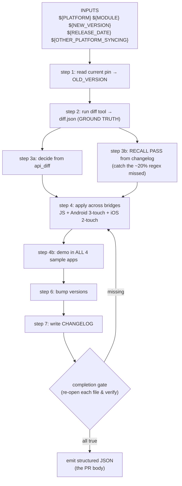

# `sync-orchestrator-cordova.md` — reading a prompt as a program

> **In one sentence:** this Markdown file is not documentation — it is the **program** Claude
> executes headless; its sections are the "steps," its constraints are the "guardrails," and its
> output schema is the "return value."
> **File:** `prompts/sync-orchestrator-cordova.md`. Rendered with `envsubst` and handed to
> `claude -p` by the [claude-sync action](./claude-sync-action.md).

A normal program is written in Python or shell. *This* program is written in English — but it still
has inputs, branches, loops, a verification gate, and a return value. Learning to read a prompt this
way is the key skill. We annotate the **key sections**, not every line, because the prose is the
content.

## The shape (read this first)



> 🧠 **Analogy:** think of it as a recipe a chef follows with nobody in the kitchen to ask. It must
> be unambiguous, name every ingredient, and end with a "before you plate it, check all of this" list
> — because if a step is skipped, the dish ships broken. "Auto-apply mode" is "the chef cooks the
> whole meal without calling out for approval."

---

## Key section 1 — Auto-apply mode (the execution model)

```
You have NO human in the loop. Do not ask questions. ... wherever any skill says
"wait for user acknowledgment", "Reply with Approved / Hold", ... treat that as:
make the best-judgment decision, proceed, and record it in your structured output.
Never stop and wait.
```

**Read as:** *"This program runs in batch mode. There is no `input()` call available."* The skills it
reuses were written for an interactive human; this line **rewrites** every "ask the user" branch into
"decide and log it." Without this, Claude would stall forever waiting for a reply that never comes.

> ### 🟦 Beginner sidebar: what is "auto-apply mode" / "no human in the loop"?
> Normally Claude Code can pause and ask you a question. Here it runs inside CI with nobody watching
> ([headless `claude -p`](./claude-sync-action.md)). So the prompt forbids questions: every decision
> point becomes "make the call, write down why." The *why* lands in the JSON that becomes the PR
> description, so a human reviews the decisions **after** the fact, on the PR — not during the run.

---

## Key section 2 — the diff tool is GROUND TRUTH, the changelog is a RECALL PASS

This is the most important idea in the whole system. Two detection sources, used for different jobs:

```
Read the resulting diff.json ... This is your ground truth. It has three parts:
  - api_diff — added / removed / changed public methods. This drives what you wrap.
  ...
The changelog is a SECOND detection source — not just narrative. The diff tool is
regex-based (~80% coverage) and can miss real API changes: multi-line signatures,
@JvmOverloads, Kotlin default-param methods, etc.
```

**Read as:** *"Trust `api_diff` as the primary list. But because the extractor is regex-based (see
[the diff tool's extraction page](./diff-native-api/03-surface-extraction-java-kotlin.md)) it misses
~20%, so do a second pass over the human changelog to catch what slipped through."*

| Source | Role | "What does it answer?" |
|--------|------|------------------------|
| `api_diff` (from the diff tool) | **Ground truth** — drives what you wrap | "What changed, machine-verified." |
| `changelog` (`target_entry` + `intermediate_entries`) | **Recall pass** — catches the regex's misses | "What did the SDK team *say* changed?" |

> ### 🟦 Beginner sidebar: what is a "recall pass"?
> "Recall" is a search term: *of everything that truly changed, how much did we find?* The regex diff
> has high precision but imperfect recall (~80%). Re-reading the changelog is a **second sweep** to
> raise recall — anything the changelog names that the diff missed gets checked against the source
> and either implemented or flagged. `intermediate_entries` covers releases skipped between the old
> pin and the new version.

---

## Key section 3 — the source-verification GATE (the anti-hallucination rule)

```
Source verification — MANDATORY before writing ANY native call
... Before you write ANY call to a native SDK symbol ... confirm its exact name and
signature in the cached native source at the NEW version. ...
HOW to check — use the Read / Grep / Glob TOOLS, not Bash. ...
If you cannot find the symbol in the native source, do NOT write the call. Put the
item in flagged_for_review (type "unconfirmed") ...
```

**Read as:** *"Before emitting any line that calls a native method, `grep` the actual SDK header to
prove the method exists. No proof → don't write it → flag it instead."* This is the single biggest
guard against a broken build, because the classic failure is Claude confidently calling a
method/selector that doesn't exist. Note the ObjC example in the prompt:
`recordChargedEventWithDetails:andItems:` is **not** `recordChargedEventWithDetails:items:` — a
selector includes every named part.

The prompt even anticipates a tooling quirk: Bash on paths outside the working dir is **denied** by
the [allowlist](./claude-sync-action.md), so it tells Claude to use the Read/Grep/Glob *tools* on the
cache path instead. Each surfaced item records `"source_verified": true|false`.

> ### 🟦 Beginner sidebar: why a "verification gate" at all?
> An LLM can produce plausible-looking-but-wrong code (a "hallucinated" method name). For a *compiled*
> bridge that's a build break. The gate converts "I think this method exists" into "I read the header
> and it does" — and if it can't, the item is **flagged** for a human rather than guessed. "A flagged
> gap is recoverable; a guessed selector is a broken build."

---

## Key section 4 — the Android 3-touch rule (a loop body that must not skip)

```
Android — the THREE touches (a missed one is a silent runtime no-op, not a compile error):
  1. src/android/CleverTapFunction.java — add the enum constant ...
  2. src/android/CleverTapPlugin.java — add the case in the execute() switch.
  3. src/android/CleverTapPlugin.java — add the private implementation ...
```

**Read as:** *"For each Android API, you must edit three places. Miss one and it still compiles — it
just silently does nothing at runtime."* That last clause is why the prompt hammers it: a missed
touch produces **no error**, so the only defense is the discipline of doing all three every time.
iOS is the analogous **2-touch** (`.h` declaration + `.m` implementation), and the JS action string
must be **identical** across the JS `cordova.exec`, the Android enum string, and the iOS selector.

> ### 🟦 Beginner sidebar: why is "3-touch" dangerous, and what is a "silent no-op"?
> A **silent no-op** is code that runs without error but does nothing. If you add the JS method and
> the `execute()` case but forget the enum constant, the app compiles and the method *exists* — it
> just never reaches the implementation. No crash, no warning. That's far worse than a compile error
> (which you'd catch immediately), so the rule is "always all three, then re-verify."

---

## Key section 5 — the completion gate (the program's assert block)

```
Before you emit — completion gate (MANDATORY)
You are NOT done until every item below is true. Before emitting the structured
JSON, re-open each file and verify — do not rely on memory. ...
For each API in your surfaced list:
  [ ] JS — CleverTap.prototype.<action> in www/CleverTap.js.
  [ ] Android — enum constant + case + private method.
  [ ] iOS — declaration + implementation.
  [ ] Every native symbol it calls was source-verified ...
  [ ] Example demo added in all 4 sample apps ...
```

**Read as:** *"A block of `assert` statements that must all pass before `return`."* Crucially it says
**re-open each file and verify — do not rely on memory**, because across a long run Claude's memory of
"I did that" can drift from what's actually on disk. The gate forces a fresh read. Only when every box
is genuinely checked does it proceed to emit.

---

## Key section 6 — the output schema (the return value)

The program ends by writing one JSON object to stdout — captured by CI to `claude-output-${PLATFORM}.json`
(the [claude-sync action](./claude-sync-action.md) extracts it; the PR generator renders it):

```json
{
  "platform": "${PLATFORM}", "module": "${MODULE}",
  "old_version": "<resolved>", "new_version": "${NEW_VERSION}",
  "surfaced": [ {"name": "...", "rationale": "...", "files_touched": ["..."], "source_verified": true} ],
  "skipped": [ ... ], "deferred": [ ... ],
  "flagged_for_review": [ {"type": "removal|deprecation|signature|behavior|unconfirmed", ...} ],
  "build_propagated": [ ... ],
  "version_bump": { "from": "5.0.0", "to": "5.1.0", "bump_type": "minor", "rationale": "..." },
  "docs_updated": ["CHANGELOG.md", "README.md"],
  "native_changelogs": { "target_version": "...", "target_entry": "...", "intermediate_entries": [...] },
  "tokens_used": 0, "cost_usd_estimate": 0.0
}
```

Each list is a "bucket" for a different decision: **`surfaced`** = implemented, **`skipped`** =
deliberately not, **`deferred`** = needs a human follow-up, **`flagged_for_review`** = couldn't be
safely auto-applied (this is where the verification gate sends its uncertain cases). `native_changelogs`
is **required** — it's pasted verbatim so the PR body can render the full native release narrative.
Even on a hard error, the prompt insists on **valid JSON with an `error` field** so CI can handle it
cleanly instead of crashing.

> ### 🟦 Beginner sidebar: why does a *prompt* define a JSON schema?
> Because the prompt's output is consumed by *other programs* (cost script, PR-description generator),
> not just read by a human. A fixed schema is the contract between Claude and those scripts — same
> reason a function documents its return type. The `flagged_for_review` bucket is how an
> *autonomous* agent stays safe: anything it isn't sure about goes to a human instead of into the code.

---

## ✅ Check yourself

<details>
<summary>1. What is the difference between the diff tool (ground truth) and the changelog (recall pass)?</summary>

`api_diff` from the diff tool is the **primary, machine-verified** list of what changed and drives
what gets wrapped. The changelog is a **second sweep** to catch the ~20% the regex extractor misses
(multi-line signatures, `@JvmOverloads`, Kotlin default params). Changelog-named items not in
`api_diff` are verified against source, then implemented or flagged.
</details>

<details>
<summary>2. Why does the prompt forbid writing a native call before checking the source?</summary>

To prevent hallucinated method/selector names that compile-break (or worse). The rule turns "I think
this exists" into "I grepped the header and it does." If the symbol can't be confirmed, the item goes
to `flagged_for_review` (type `unconfirmed`) rather than being guessed.
</details>

<details>
<summary>3. Why is a missed Android "touch" called a *silent no-op* — and why is that worse than a compile error?</summary>

Forgetting one of the three Android edits (enum constant / `execute()` case / private method) still
**compiles**, but the method never reaches its implementation — it runs and does nothing, with no
error. A compile error would be caught instantly; a silent no-op ships unnoticed, so the prompt
mandates all three plus a re-verify.
</details>

<details>
<summary>4. What does "re-open each file and verify — do not rely on memory" protect against?</summary>

Over a long autonomous run, the model's recollection of "I edited that" can diverge from the actual
file contents. The completion gate forces a fresh read of each file so the emitted JSON reflects
what's truly on disk, not what Claude *thinks* it did.
</details>

**Next:** [diff-native-api/00-overview.md — the ground-truth tool, in one page →](./diff-native-api/00-overview.md)
