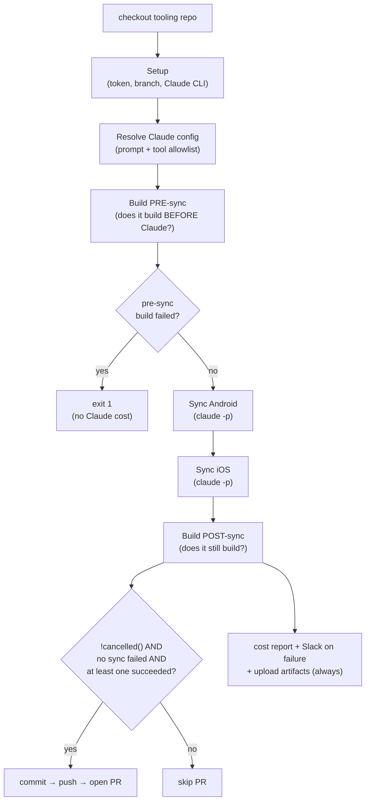

# `sync.yml` — the Conductor

> **In one sentence:** this is the reusable workflow that wires every step together — checkout,
> setup, build, run Claude per platform, then *decide* (with tricky `if:` expressions) whether to
> commit, push, and open the PR.
> **File:** `.github/workflows/sync.yml`. This is **Layer ② (the Conductor)** of the
> [4-layer onion](../00-primer/02-the-4-layer-onion.md).

The conductor itself is "thin": all the real work lives in **composite actions** it calls. Its job
is **orchestration** — the order of steps, and the conditions under which each one runs. The hardest
part to read is the cluster of `if:` conditions that gate the commit / push / open-PR steps, so those
get the line-by-line treatment. Everything else gets annotated highlights.

## The shape (read this first)



> 🧠 **Analogy:** the conductor is the person at the front of the orchestra. They don't play an
> instrument; they decide *when* each section plays and *whether* the concert goes ahead. The `if:`
> expressions are the conductor's "play / don't play" hand signals.

---

## The inputs and secrets (annotated highlights)

The workflow opens by declaring what it accepts. This is the `on: workflow_call:` block — it means
"another workflow may *call* me and pass these values in."

```yaml
on:
  workflow_call:                       # ① I am a REUSABLE workflow — callable by others
    inputs:
      wrapper:
        description: 'Wrapper name (react-native, flutter, ...). Selects the build action, prompt, and tool allowlist.'
        required: true                 # ② must be supplied — there is no default
        type: string
      android_version:
        description: 'New Android version (e.g. 8.2.0). Empty skips Android.'
        required: false
        type: string
        default: ''                    # ③ empty string = "skip this platform"
      ...
      skip_sync:
        description: 'Skip Claude Sync + post-sync builds. ...'
        type: boolean
        default: false
    secrets:
      app_id:
        required: true                 # ④ secrets are passed separately from inputs
      anthropic_api_key:
        required: true
      ...
```

| # | What this declares | In plain English |
|---|--------------------|------------------|
| ① | `workflow_call` | "I'm not triggered by a push or a button. Another workflow calls me like a function." (See the [wrapper-dispatch](./wrapper-dispatch.md) page for the caller.) |
| ② | `required: true` | "The caller MUST give me a `wrapper` value. There's no fallback." |
| ③ | `default: ''` | "If the caller leaves a version empty, that platform is skipped — empty means *skip*." |
| ④ | `secrets:` block | "Passwords/keys come through a separate, redacted channel — never printed in logs." |

> ### 🟦 Beginner sidebar: what is a *reusable workflow*?
> A normal GitHub Actions workflow is triggered by an event (a push, a schedule, a button). A
> **reusable workflow** (`on: workflow_call`) is triggered by *another workflow calling it* — like a
> function you call with arguments. One copy of the logic lives here; every wrapper repo
> (cordova, react-native, flutter) calls the *same* file. Fix a bug once, every repo benefits. See
> [GLOSSARY](../GLOSSARY.md).

> ### 🟦 Beginner sidebar: inputs vs secrets
> **Inputs** are ordinary values (version numbers, names) and are fine to print in logs. **Secrets**
> (API keys, App private keys) go in a separate `secrets:` block; GitHub automatically masks them in
> logs so they never leak. Same idea, two doors — one public, one locked.

---

## The job structure (annotated highlights)

```yaml
jobs:
  sync:
    runs-on: macos-14                  # ① a fresh macOS machine (needed for iOS/Xcode builds)
    timeout-minutes: 90                # ② hard stop after 90 min so a hung run can't bill forever
    steps:
      - name: Checkout tooling repo (this repo)
        uses: actions/checkout@v4      # ③ grab THIS repo first — its composite actions are needed
        with:
          repository: CleverTap/clevertap-wrapper-tooling
          path: tooling                # ④ put it in a folder named `tooling/`
      - name: Setup
        id: setup
        uses: ./tooling/.github/actions/setup   # ⑤ run a COMPOSITE action (a bundle of steps)
        with:
          ...
```

| # | What this does | In plain English |
|---|----------------|------------------|
| ① | `runs-on: macos-14` | "Rent a Mac to run on — required because the Cordova/RN/Flutter iOS builds need Xcode." |
| ② | `timeout-minutes: 90` | "If the whole job runs past 90 minutes, kill it. Safety valve against a stuck run." |
| ③ | `actions/checkout@v4` | "Download the tooling repo's files onto the machine so we can use its actions and scripts." |
| ④ | `path: tooling` | "Clone it into `tooling/` (the wrapper repo is cloned separately into `wrapper/` by Setup)." |
| ⑤ | `uses: ./...actions/setup` | "Run a reusable bundle of steps. This one mints a token, clones the wrapper, makes a branch, installs the Claude CLI." |

> ### 🟦 Beginner sidebar: what is a *composite action*?
> A **composite action** is a reusable bundle of steps with its own `action.yml`. The conductor calls
> them with `uses: ./path` — like calling a function. `setup`, `claude-sync`, `build/cordova`, and
> `open-pr` are all composite actions. The conductor just lists them in order; each does one chunk of
> work. See [claude-sync-action.md](./claude-sync-action.md) and [build-cordova-action.md](./build-cordova-action.md).

The `Resolve Claude config` step (lines 108–127) picks the **prompt file** and the **tool allowlist**
for the wrapper. For Cordova it selects `prompts/sync-orchestrator-cordova.md` (the
[program Claude runs](./orchestrator-prompt-cordova.md)) and pins `python3` to *only* the diff tool —
so Claude can't run arbitrary Python. That allowlist is the security fence.

---

## The two Sync steps and their `if:` (line-by-line begins)

```yaml
      - name: Sync Android
        id: sync_android
        if: inputs.android_version != '' && !inputs.skip_sync   # ①
        uses: ./tooling/.github/actions/claude-sync
        ...
      - name: Sync iOS
        id: sync_ios
        if: inputs.ios_version != '' && !inputs.skip_sync       # ②
        uses: ./tooling/.github/actions/claude-sync
        ...
```

| # | The condition | In plain English |
|---|---------------|------------------|
| ① | `inputs.android_version != '' && !inputs.skip_sync` | "Run the Android sync **only if** an Android version was given (`!= ''` means *not empty*) **AND** the user didn't ask to skip syncing (`!skip_sync`)." |
| ② | same, for iOS | "Same rule, for the iOS sync." |

> ### 🟦 Beginner sidebar: reading `&&`, `!`, and `!= ''`
> These are **boolean operators**, same as most languages. `&&` = AND (both sides must be true).
> `!x` = NOT x (flips true/false). `x != ''` = "x is not the empty string." So
> `android_version != '' && !skip_sync` reads as: *"there is an Android version, and skip_sync is
> off."* Each step's `id:` (e.g. `sync_android`) lets later steps refer back to its **outcome**.

> ### 🟦 Beginner sidebar: what is an `outcome`?
> Every step records an `outcome`: `success`, `failure`, `cancelled`, or `skipped` (if its `if:` was
> false). Later steps read it as `steps.<id>.outcome`. The whole commit/PR decision below is built
> from these outcome values.

---

## The gating expression, decoded line-by-line (the hard part)

These three conditions guard **Commit**, **Push**, and **Open PR**. Here is the full **Open combined PR** gate:

```yaml
      - name: Open combined PR
        if: |
          !cancelled()                                                          # ①
          && env.no_changes != 'true'                                           # ②
          && steps.sync_android.outcome != 'failure'                            # ③
          && steps.sync_ios.outcome != 'failure'                                # ④
          && (steps.sync_android.outcome == 'success' || steps.sync_ios.outcome == 'success')   # ⑤
        uses: ./tooling/.github/actions/open-pr
        ...
```

Read it as **one big AND** — *every* line must be true for the step to run:

| # | The clause | In plain English | Why it's there |
|---|-----------|------------------|----------------|
| ① | `!cancelled()` | "The run was NOT cancelled by a human or timeout." | Default Actions behaviour skips later steps once *anything* fails. We need this step to run **even after a failed post-sync build**, so we explicitly say "as long as we weren't cancelled." |
| ② | `env.no_changes != 'true'` | "Claude actually changed files — the commit step didn't flag a no-op." | If Claude made zero edits, there's nothing to open a PR for. The Commit step sets `no_changes=true` in that case. |
| ③ | `steps.sync_android.outcome != 'failure'` | "The Android sync did **not** fail." | A *failed* sync means Claude errored mid-edit — don't ship a half-done PR. Note: a *skipped* Android sync (no version) is NOT a failure, so this still passes. |
| ④ | `steps.sync_ios.outcome != 'failure'` | "The iOS sync did **not** fail." | Same guard for iOS. |
| ⑤ | `(android == 'success' \|\| ios == 'success')` | "**At least one** platform sync actually succeeded." | `\|\|` is OR. Both syncs being *skipped* would pass ③ and ④ but produce no work — this clause requires at least one real success before opening a PR. |

> ### 🟦 Beginner sidebar: what does `!cancelled()` mean — and why is it everywhere?
> By default, GitHub Actions **skips** any remaining step the moment an earlier step fails. That's
> usually what you want — but here a *post-sync build failure* should still let the PR open (with a
> "build-failed" label) so a human can look. To override the default skip, every "should still run"
> step starts with a status function: `!cancelled()` ("run unless the whole thing was cancelled"),
> `always()` ("run no matter what"), or `failure()` ("run only if something failed"). Without one of
> these, the skip-on-failure default wins. See [GLOSSARY](../GLOSSARY.md).

> ### 🟦 Beginner sidebar: why `!= 'failure'` instead of `== 'success'`?
> Subtle but important. A step that was **skipped** (its `if:` was false — e.g. no iOS version) has
> outcome `skipped`, *not* `success`. If the gate said `ios.outcome == 'success'` it would wrongly
> block Android-only runs. Saying `ios.outcome != 'failure'` lets *skipped* through while still
> blocking *failed*. Clause ⑤ then separately insists *at least one* really succeeded.

The **Commit** and **Push** gates are the same expression with one extra guard: Push and Open-PR add
`env.no_changes != 'true'`, and Push obviously only runs after a successful commit. Commit sets that
`no_changes` flag:

```yaml
      - name: Commit changes
        if: |
          !cancelled()
          && steps.sync_android.outcome != 'failure'
          && steps.sync_ios.outcome != 'failure'
          && (steps.sync_android.outcome == 'success' || steps.sync_ios.outcome == 'success')
        working-directory: wrapper
        shell: bash
        run: |
          git add -A
          if git diff --cached --quiet; then                        # ① did anything actually change?
            echo "::warning::No changes to commit. Sync was a no-op."
            echo "no_changes=true" >> "$GITHUB_ENV"                 # ② remember it for later steps
            exit 0
          fi
          git commit -m "$(cat <<EOF                                # ③ multi-line commit message
          task: sync wrapper with native release $(date -u +%Y-%m-%d)
          ...
          EOF
          )"
```

| # | What this does | In plain English |
|---|----------------|------------------|
| ① | `git diff --cached --quiet` | "Are there staged changes? `--quiet` makes git return success (0) if there are NONE." So the `if` body runs precisely when there is *nothing* to commit. |
| ② | `>> "$GITHUB_ENV"` | "Write `no_changes=true` into the shared env file so the Push and Open-PR `if:` can read `env.no_changes`." |
| ③ | `cat <<EOF ... EOF` | "A **heredoc** — a way to write a multi-line string (the commit message) inline in the shell." |

---

## Always-run housekeeping (annotated highlights)

A few steps are deliberately set to run regardless of success/failure:

```yaml
      - name: Flag post-sync build failure
        if: always() && (steps.outcomes.outputs.android == 'failure' || steps.outcomes.outputs.ios == 'failure')
        ...                                   # re-asserts a red run so maintainers get pinged
      - name: Slack ping on failure
        if: failure() && steps.setup.outcome == 'success'
        ...                                   # only ping once setup got far enough to matter
      - name: Upload sync outputs as artifacts
        if: always()                          # ALWAYS save the JSON/stream/stderr logs for debugging
        uses: actions/upload-artifact@v4
        with:
          name: sync-outputs
          path: |
            claude-output-android.json
            claude-output-ios.json
            claude-stream-android.jsonl
            ...
          if-no-files-found: ignore
```

- **`Flag post-sync build failure`** uses `always()` so that even though the PR already opened, a
  failed *build* still turns the run red (and triggers Slack). The PR carries a `build-failed` label.
- **`Slack ping on failure`** uses `failure()` — it fires only when something failed, and only if
  `setup` got far enough to be meaningful.
- **`Upload sync outputs`** uses `always()` + `if-no-files-found: ignore` so the debug artifacts (the
  exact JSON/stream Claude produced — see [claude-sync-action.md](./claude-sync-action.md)) are saved
  even on a crash, and a missing file doesn't itself fail the step.

> ### 🟦 Beginner sidebar: `always()` vs `failure()` vs `!cancelled()`
> Three status functions, three behaviours: **`always()`** runs no matter what (even on cancel).
> **`failure()`** runs only if a prior step failed. **`!cancelled()`** runs unless the run was
> cancelled — i.e. on success *or* failure, but not cancel. Pick by intent: "save logs no matter
> what" → `always()`; "ping me only when broken" → `failure()`; "open the PR even on a build failure,
> but not if someone hit cancel" → `!cancelled()`.

---

## ✅ Check yourself

<details>
<summary>1. In the Open-PR gate, why <code>sync_ios.outcome != 'failure'</code> instead of <code>== 'success'</code>?</summary>

Because an Android-only run **skips** the iOS sync, and a skipped step's outcome is `skipped`, not
`success`. `== 'success'` would wrongly block that run. `!= 'failure'` lets *skipped* through while
still blocking a genuine *failure*. Clause ⑤ separately guarantees at least one platform succeeded.
</details>

<details>
<summary>2. What does <code>!cancelled()</code> at the front of the gate buy us?</summary>

It overrides Actions' default "skip everything after a failure." A *post-sync build* failure should
still let the PR open (with a build-failed label) so a human can review. `!cancelled()` says "run on
success or failure — just not if the whole run was cancelled."
</details>

<details>
<summary>3. Where does <code>env.no_changes</code> come from, and what does it gate?</summary>

The **Commit changes** step sets `no_changes=true` (into `$GITHUB_ENV`) when `git diff --cached
--quiet` finds nothing staged. The **Push** and **Open PR** steps then refuse to run when
`env.no_changes == 'true'` — no point pushing/PR-ing an empty diff.
</details>

<details>
<summary>4. Why is the artifact-upload step <code>if: always()</code>?</summary>

So Claude's output JSON, the full event stream, and stderr are saved **even when the run failed** —
those are exactly the files you need to debug a failure. `if-no-files-found: ignore` keeps a missing
file from failing the upload itself.
</details>

**Next:** [claude-sync-action.md — how Claude is actually invoked →](./claude-sync-action.md)
