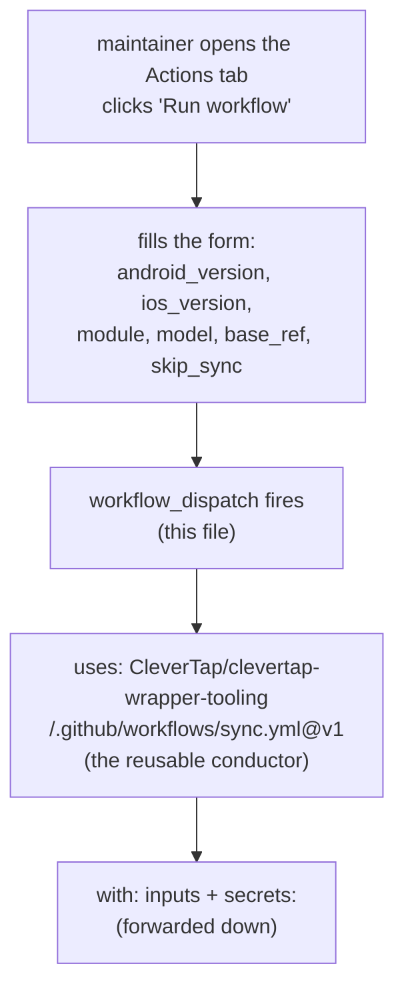

# `native-release-sync.yml` — the trigger form

> **In one sentence:** this 73-line workflow lives in the *wrapper* repo (clevertap-cordova); it's a
> thin "button" a maintainer presses, collecting the target versions and handing everything to the
> reusable [conductor](./sync-yml.md) in the tooling repo.
> **File:** `clevertap-cordova/.github/workflows/native-release-sync.yml`.

This is where a sync **starts**. There's no logic here to speak of — it's a form definition plus one
function call. Annotated highlights: the `workflow_dispatch` inputs, and the `uses:` line that routes
to the central tooling.

## The shape (read this first)



> 🧠 **Analogy:** this file is the **order form** at a counter. You tick the boxes (which version,
> which model) and hand it over; the kitchen ([sync.yml](./sync-yml.md)) does the cooking. The form
> doesn't cook — it just collects the order and passes it back.

---

## Highlight 1 — `workflow_dispatch` makes the manual button

```yaml
on:
  workflow_dispatch:                  # ① "show a 'Run workflow' button in the Actions tab"
    inputs:
      android_module:
        description: 'Android module being bumped'
        type: choice                  # ② a DROPDOWN, not a free-text box
        options: [none, core, pushtemplates, hms]
        default: core
      android_version:
        description: 'New Android version (e.g. 8.3.0). Leave empty to skip Android.'
        type: string                  # ③ free text
        default: ''                   # ④ empty = skip this platform
      ...
      model:
        description: 'Claude model (alias)'
        type: choice
        options: [sonnet, opus, haiku]
        default: sonnet
      skip_sync:
        description: 'Skip Claude Sync + post-sync builds ...'
        type: boolean                 # ⑤ a checkbox
        default: false
```

| # | What this declares | In plain English |
|---|--------------------|------------------|
| ① | `on: workflow_dispatch` | "This workflow is triggered **by hand** — it puts a *Run workflow* button in the GitHub Actions UI. No push or schedule starts it." |
| ② | `type: choice` + `options:` | "Render a dropdown so the maintainer can only pick a valid module (`none/core/pushtemplates/hms`) — no typos." |
| ③ | `type: string` | "Version is free text (you type `8.3.0`)." |
| ④ | `default: ''` | "Leaving it blank means *skip that platform* — the conductor treats empty as skip." |
| ⑤ | `type: boolean` | "Renders a checkbox; `skip_sync` lets you exercise the build pipeline without paying for Claude." |

> ### 🟦 Beginner sidebar: what is `workflow_dispatch`?
> It's the trigger that makes a workflow **manually runnable**. With it, the Actions tab shows a
> "Run workflow" button and a form built from the `inputs:` you declare. Contrast with `on: push`
> (runs on every push) or `on: schedule` (runs on a timer). Here a human decides *when* to sync and
> *what* versions, so a manual button is exactly right. See [GLOSSARY](../GLOSSARY.md).

---

## Highlight 2 — the `uses:` call routes to the central conductor

```yaml
jobs:
  sync:
    uses: CleverTap/clevertap-wrapper-tooling/.github/workflows/sync.yml@v1   # ①
    with:
      wrapper:         cordova                                                # ②
      android_module:  ${{ inputs.android_module != 'none' && inputs.android_module || '' }}   # ③
      android_version: ${{ inputs.android_version }}
      ...
      skip_sync:       ${{ inputs.skip_sync }}
    secrets:
      app_id:            ${{ secrets.CLEVERTAP_WRAPPER_SYNC_APP_ID }}         # ④
      app_private_key:   ${{ secrets.CLEVERTAP_WRAPPER_SYNC_PRIVATE_KEY }}
      anthropic_api_key: ${{ secrets.ANTHROPIC_API_KEY }}
      slack_webhook_url: ${{ secrets.SLACK_WEBHOOK_URL }}
```

| # | What this does | In plain English |
|---|----------------|------------------|
| ① | `uses: CleverTap/...sync.yml@v1` | "Call the **reusable conductor** in the tooling repo, pinned to the `v1` tag. This is the one line that hands off all the real work." |
| ② | `wrapper: cordova` | "Tell the conductor *which* wrapper this is — it uses this to pick the Cordova build action, prompt, and tool allowlist." |
| ③ | `inputs.x != 'none' && inputs.x || ''` | "A ternary trick: if the module isn't `none`, pass it through; otherwise pass empty string (= skip). Translates the friendly `none` dropdown option into the conductor's 'empty means skip' convention." |
| ④ | `secrets:` block | "Forward the repo's secrets to the conductor by name. The App id + private key mint a token; the Anthropic key runs Claude; the Slack URL pings on failure." |

> ### 🟦 Beginner sidebar: what does `uses: …/sync.yml@v1` mean?
> `uses:` on a *job* (not a step) calls another workflow as a **reusable workflow** — the caller side
> of the `on: workflow_call` you saw in [sync.yml](./sync-yml.md). `@v1` pins which version (a git
> tag) to call, so an in-progress change to the tooling repo's `main` can't break every wrapper's
> sync without a deliberate re-tag. The `with:` maps to the conductor's `inputs:`; the `secrets:`
> maps to its `secrets:`.

> ### 🟦 Beginner sidebar: the `x != 'none' && x || ''` ternary
> GitHub expressions have no `if`, so this is the idiom for one. `A && B || C` evaluates to **B when A
> is true, else C**. So `android_module != 'none' && android_module || ''` means "if the dropdown
> isn't `none`, use the module name; otherwise use empty string." The form shows a friendly `none`;
> the conductor only understands "empty = skip" — this line bridges the two.

> ### 🟦 Beginner sidebar: what is a GitHub App token (and why not a personal token)?
> The header lists `CLEVERTAP_WRAPPER_SYNC_APP_ID` + `..._PRIVATE_KEY` — credentials for a **GitHub
> App** named `clevertap-wrapper-sync`. The conductor's Setup step exchanges them for a short-lived
> token used to push the branch and open the PR. An App token is preferred over a personal access
> token because it's scoped to just this automation, isn't tied to one person's account, and expires
> quickly — so the bot's commits and PRs are clearly attributable to the automation. See
> [GLOSSARY](../GLOSSARY.md).

---

## What it deliberately does NOT do

The file's own header says it best: *"This is a thin wrapper: it collects the target versions and
routes all the real work to the reusable workflow in the central tooling repo."* No checkout, no
build, no Claude call lives here. Keeping the wrapper file tiny means every wrapper repo (cordova,
react-native, flutter) has the same ~70-line form, and all the actual logic is maintained **once** in
the tooling repo's [conductor](./sync-yml.md).

---

## ✅ Check yourself

<details>
<summary>1. What does <code>on: workflow_dispatch</code> give you, and why is it the right trigger here?</summary>

It adds a manual **Run workflow** button (and a form from the declared `inputs:`) in the Actions tab.
It's right because a human decides when to sync and which versions — there's no push or schedule that
should auto-trigger a native-SDK bump.
</details>

<details>
<summary>2. What is the single line that does the real handoff, and what does <code>@v1</code> mean?</summary>

`uses: CleverTap/clevertap-wrapper-tooling/.github/workflows/sync.yml@v1`. It calls the reusable
conductor; `@v1` pins it to the `v1` git tag so unreleased tooling changes can't silently break every
wrapper's sync.
</details>

<details>
<summary>3. Why <code>android_module != 'none' && android_module || ''</code> instead of just passing the value?</summary>

The form offers a friendly `none` option, but the conductor's convention is "empty string = skip." This
ternary translates `none` into `''` (and passes any real module through), bridging the UI to the
conductor's contract.
</details>

<details>
<summary>4. Why use a GitHub App's id + private key rather than a personal access token?</summary>

The App token is scoped to just this automation, isn't tied to a single person's account, and is
short-lived. Branch pushes and PRs are then clearly attributed to the `clevertap-wrapper-sync` bot
rather than a human, and the blast radius if leaked is small.
</details>

**Next:** [sync-yml.md — what the conductor does with this order →](./sync-yml.md)
